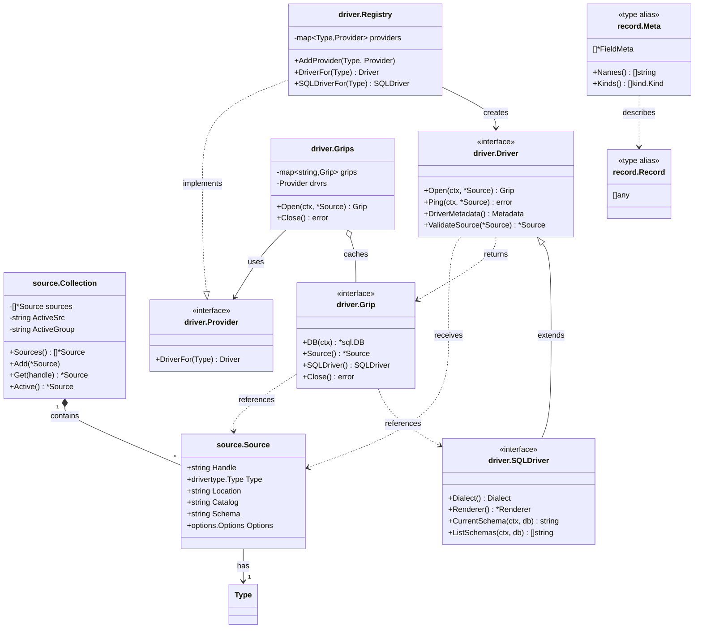

# Architecture

This document provides high-level guidance on the key `sq` concepts.

This is effectively an ERD (Entity Relationship Diagram).

```mermaid
classDiagram
    class `source.Collection` {
        -[]*Source sources
        -string ActiveSrc
        -string ActiveGroup
        +Sources() []*Source
        +Add(*Source)
        +Get(handle) *Source
        +Active() *Source
    }

    class `source.Source` {
        +string Handle
        +drivertype.Type Type
        +string Location
        +string Catalog
        +string Schema
        +options.Options Options
    }

    class `driver.Registry` {
        -map~Type,Provider~ providers
        +AddProvider(Type, Provider)
        +DriverFor(Type) Driver
        +SQLDriverFor(Type) SQLDriver
    }

    class `driver.Provider` {
        <<interface>>
        +DriverFor(Type) Driver
    }

    class `driver.Driver` {
        <<interface>>
        +Open(ctx, *Source) Grip
        +Ping(ctx, *Source) error
        +DriverMetadata() Metadata
        +ValidateSource(*Source) *Source
    }

    class `driver.SQLDriver` {
        <<interface>>
        +Dialect() Dialect
        +Renderer() *Renderer
        +CurrentSchema(ctx, db) string
        +ListSchemas(ctx, db) []string
    }

    class `driver.Grips` {
        -map~string,Grip~ grips
        -Provider drvrs
        +Open(ctx, *Source) Grip
        +Close() error
    }

    class `driver.Grip` {
        <<interface>>
        +DB(ctx) *sql.DB
        +Source() *Source
        +SQLDriver() SQLDriver
        +Close() error
    }

    class `record.Record` {
        <<type alias>>
        []any
    }

    class `record.Meta` {
        <<type alias>>
        []*FieldMeta
        +Names() []string
        +Kinds() []kind.Kind
    }

    `source.Collection` "1" *-- "*" `source.Source` : contains
    `source.Source` --> "1" Type : has
    `driver.Registry` ..|> `driver.Provider` : implements
    `driver.Registry` --> `driver.Driver` : creates
    `driver.SQLDriver` --|> `driver.Driver` : extends
    `driver.Driver` ..> `source.Source` : receives
    `driver.Driver` ..> `driver.Grip` : returns
    `driver.Grips` --> `driver.Provider` : uses
    `driver.Grips` o-- `driver.Grip` : caches
    `driver.Grip` ..> `source.Source` : references
    `driver.Grip` ..> `driver.SQLDriver` : references
    `record.Meta` ..> `record.Record` : describes
```
