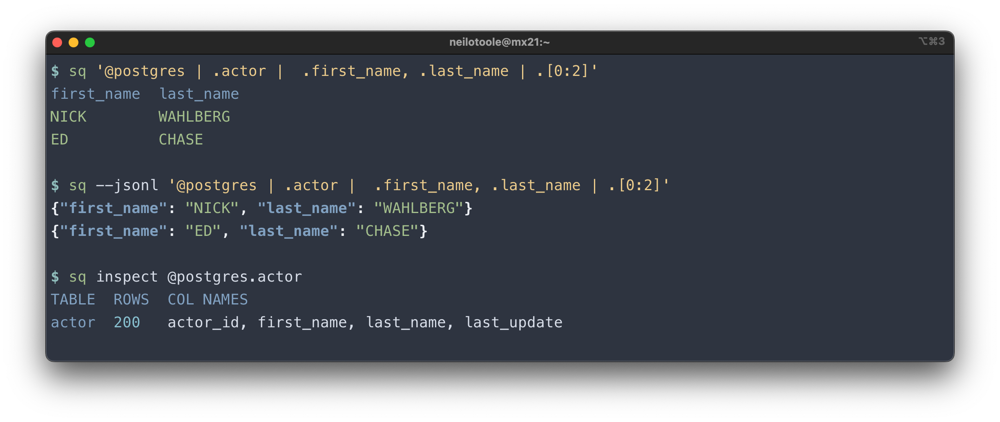
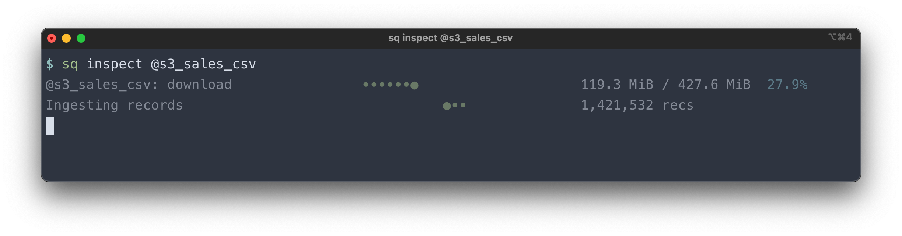
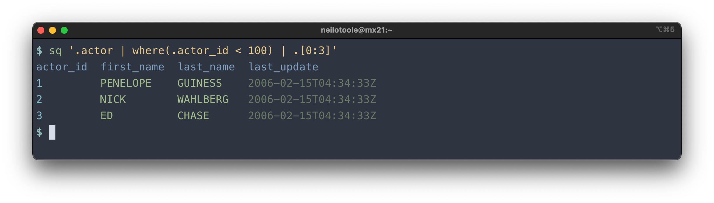
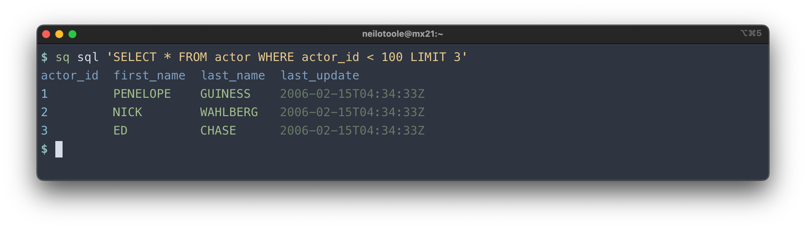
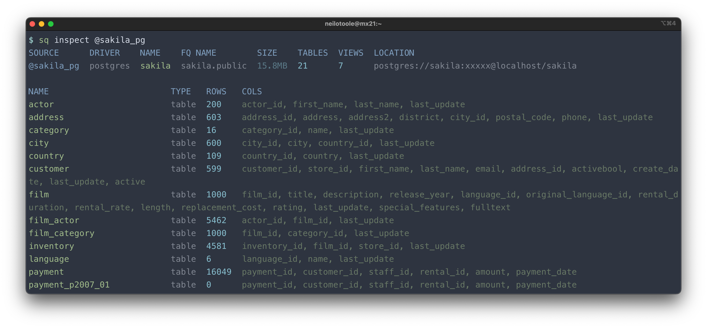
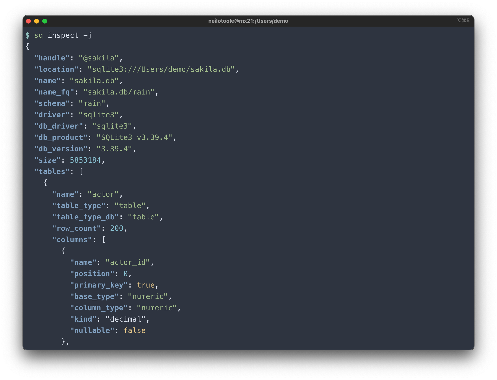
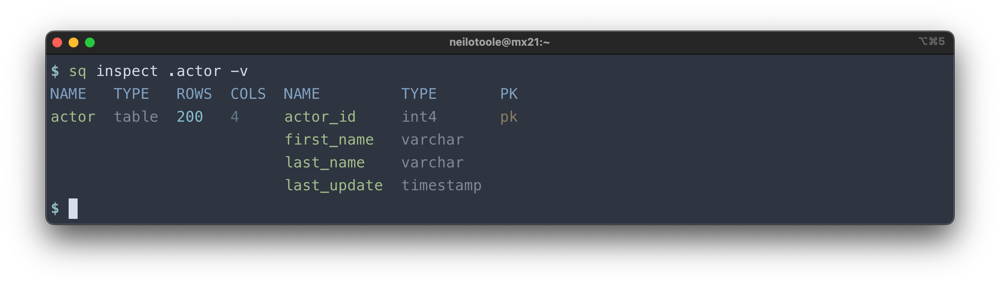
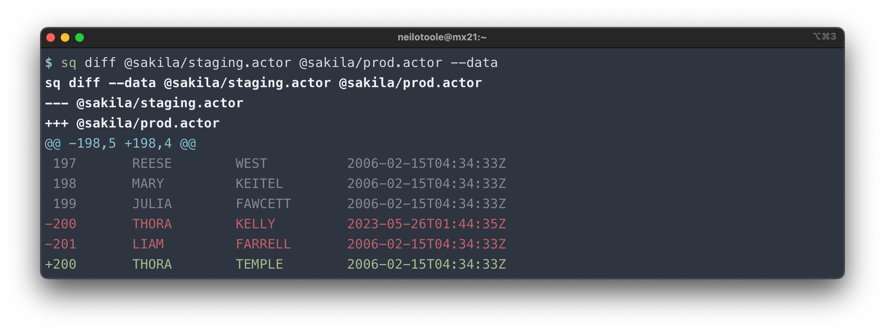
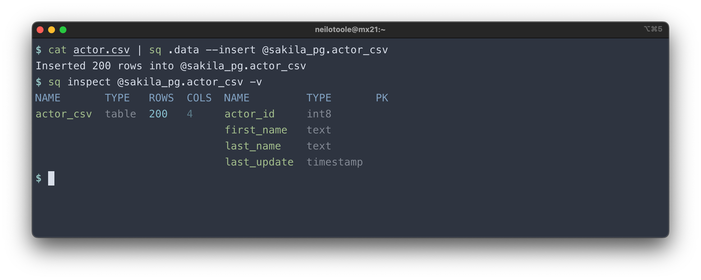
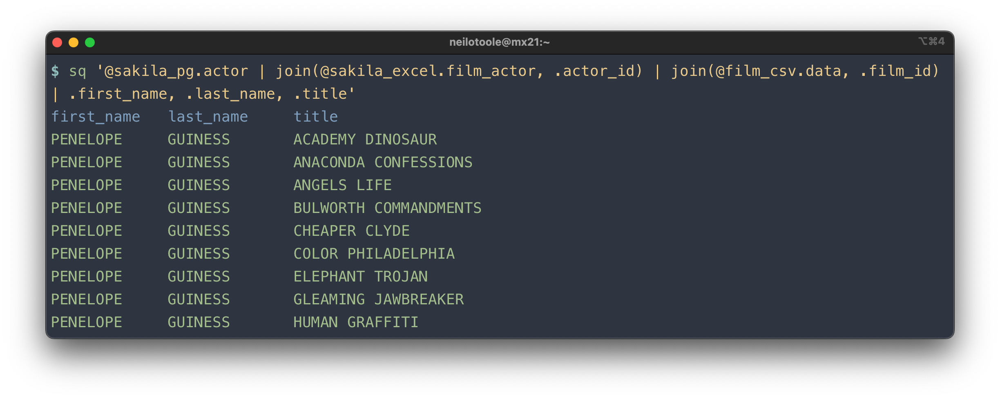

[](https://pkg.go.dev/github.com/neilotoole/sq)
[](https://goreportcard.com/report/neilotoole/sq)
[](https://github.com/neilotoole/sq/blob/master/LICENSE)


# sq data wrangler

`sq` is a command line tool that provides jq-style access to
structured data sources: SQL databases, or document formats like CSV or Excel.
It is the lovechild of sql+jq.



`sq` executes jq-like [queries](https://sq.io/docs/query), or database-native [SQL](https://sq.io/docs/cmd/sql/).
It can [join](https://sq.io/docs/query#cross-source-joins) across sources: join a CSV file to a Postgres table, or
MySQL with Excel.

`sq` outputs to a multitude of [formats](https://sq.io/docs/output#formats)
including [JSON](https://sq.io/docs/output#json),
[Excel](https://sq.io/docs/output#xlsx), [CSV](https://sq.io/docs/output#csv),
[HTML](https://sq.io/docs/output#html), [Markdown](https://sq.io/docs/output#markdown) 
and [XML](https://sq.io/docs/output#xml), and can [insert](https://sq.io/docs/output#insert) query 
results directly to a SQL database.

`sq` can also [inspect](https://sq.io/docs/inspect) sources to view metadata about the source structure (tables,
columns, size). You can use [`sq diff`](https://sq.io/docs/diff) to compare tables, or
entire databases. `sq` has commands for common database operations to
[copy](https://sq.io/docs/cmd/tbl-copy), [truncate](https://sq.io/docs/cmd/tbl-truncate),
and [drop](https://sq.io/docs/cmd/tbl-drop) tables.

Find out more at [sq.io](https://sq.io).


## Install

### macOS

```shell
brew install sq
```
> [!IMPORTANT]
> `sq` is now a [core brew formula](https://formulae.brew.sh/formula/sq#default). Previously, `sq` was available via `brew install neilotoole/sq/sq`. If you have installed `sq` this way, you should uninstall it (`brew uninstall neilotoole/sq/sq`) before installing the new formula via `brew install sq`.

### Linux

```shell
/bin/sh -c "$(curl -fsSL https://sq.io/install.sh)"
```

### Windows

```shell
scoop bucket add sq https://github.com/neilotoole/sq
scoop install sq
```

### Go

```shell
go install github.com/neilotoole/sq
```

### Docker

The [`ghcr.io/neilotoole/sq`](https://github.com/neilotoole/sq/pkgs/container/sq)
image is preloaded with `sq` and a handful of related tools like `jq`.

#### Local

```shell
# Shell into a one-time container.
$ docker run -it ghcr.io/neilotoole/sq zsh

# Start detached (background) container named "sq-shell".
$ docker run -d --name sq-shell ghcr.io/neilotoole/sq
# Shell into that container.
$ docker exec -it sq-shell zsh 
```

#### Kubernetes

Running `sq` in a Kubernetes environment is useful for DB migrations,
as well as general data wrangling.

```shell
# Start pod named "sq-shell".
$ kubectl run sq-shell --image ghcr.io/neilotoole/sq
# Shell into the pod.
$ kubectl exec -it sq-shell -- zsh 
```


See other [install options](https://sq.io/docs/install/).

## Overview

Use `sq help` to see command help. Docs are over at [sq.io](https://sq.io).
Read the [overview](https://sq.io/docs/overview/), and 
[tutorial](https://sq.io/docs/tutorial/). The [cookbook](https://sq.io/docs/cookbook/) has
recipes for common tasks, and the [query guide](https://sq.io/docs/query) covers `sq`'s query language.

The major concept is: `sq` operates on data sources, which are treated as SQL databases (even if the
source is really a CSV or XLSX file etc.).

In a nutshell, you [`sq add`](https://sq.io/docs/cmd/add) a source (giving it a [`handle`](https://sq.io/docs/concepts#handle)), and then execute commands against the
source.

### Sources

Initially there are no [sources](https://sq.io/docs/source).

```shell
$ sq ls

```

Let's [add](https://sq.io/docs/cmd/add) a source. First we'll add a [SQLite](https://sq.io/docs/drivers/sqlite)
database, but this could also be [Postgres](https://sq.io/docs/drivers/postgres),
[SQL Server](https://sq.io/docs/drivers/sqlserver) etc., or a document source such [Excel](https://sq.io/docs/drivers/xlsx) or
[CSV](https://sq.io/docs/drivers/csv).

Download the sample DB, and `sq add` the source. 

```shell
$ wget https://sq.io/testdata/sakila.db

$ sq add ./sakila.db
@sakila  sqlite3  sakila.db

$ sq ls -v
HANDLE   ACTIVE  DRIVER   LOCATION                         OPTIONS
@sakila  active  sqlite3  sqlite3:///Users/demo/sakila.db

$ sq ping @sakila
@sakila       1ms  pong

$ sq src
@sakila  sqlite3  sakila.db
```

The [`sq ping`](https://sq.io/docs/cmd/ping) command simply pings the source
to verify that it's available.

[`sq src`](https://sq.io/docs/cmd/src) lists the [_active source_](https://sq.io/docs/source#active-source), which in our
case is `@sakila`.
You can change the active source using `sq src @other_src`.
When there's an active source specified, you can usually omit the handle from `sq` commands.
Thus you could instead do:

```shell
$ sq ping
@sakila  1ms  pong
```

> [!TIP]
> Document sources such as CSV or Excel can be added from the local filesystem, or
> from an HTTP URL. 
> 
> ```shell
> $ sq add https://acme.s3.amazonaws.com/sales.csv
> ```
> 
> 
> See the [sources](https://sq.io/docs/source#download) docs for more.


### Query

Fundamentally, `sq` is for querying data. The jq-style syntax is covered in
detail in the [query guide](https://sq.io/docs/query).



The above query selected some rows from the `actor` table. You could also
use [native SQL](https://sq.io/docs/cmd/sql), e.g.:



But we're flying a bit blind here: how did we know about the `actor` table?

### Inspect

[`sq inspect`](https://sq.io/docs/inspect) is your friend.



Use [`sq inspect -v`](https://sq.io/docs/cmd/inspect) to see more detail.
Or use [`-j`](https://sq.io/docs/output#json) to get JSON output:



Combine `sq inspect` with [jq](https://jqlang.github.io/jq/) for some useful capabilities.
Here's how to [list](https://sq.io/docs/cookbook#list-table-names)
all the table names in the active source:

```shell
$ sq inspect -j | jq -r '.tables[] | .name'
actor
address
category
city
country
customer
[...]
```

And here's how you
could [export](https://sq.io/docs/cookbook#export-all-table-data-to-csv) each table
to a CSV file:

```shell
$ sq inspect -j | jq -r '.tables[] | .name' | xargs -I % sq .% --csv --output %.csv
$ ls
actor.csv     city.csv	    customer_list.csv  film_category.csv  inventory.csv  rental.csv		     staff.csv
address.csv   country.csv   film.csv	       film_list.csv	  language.csv	 sales_by_film_category.csv  staff_list.csv
category.csv  customer.csv  film_actor.csv     film_text.csv	  payment.csv	 sales_by_store.csv	     store.csv
```

Note that you can also inspect an individual table:



Read more about [`sq inspect`](https://sq.io/docs/inspect).

### Diff

Use [`sq diff`](https://sq.io/docs/diff) to compare metadata, or row data, for sources, or individual tables.

The default behavior is to diff table schema and row counts. Table row data is not compared in this mode.


Use [`--data`](https://sq.io/docs/diff#--data) to compare row data.



There are many more options available. See the [diff docs](https://sq.io/docs/diff).


### Insert query results

`sq` query results can be [output](https://sq.io/docs/output) in various formats 
([`text`](https://sq.io/docs/output#text),
[`json`](https://sq.io/docs/output#json),
[`csv`](https://sq.io/docs/output#csv), etc.). Those results can also be "outputted"
as an [*insert*](https://sq.io/docs/output#insert) into a database table.

That is, you can use `sq` to insert results from a Postgres query into a MySQL table,
or copy an Excel worksheet into a SQLite table, or a push a CSV file into
a SQL Server table etc.

> [!TIP]
> If you want to copy a table inside the same (database) source,
> use [`sq tbl copy`](https://sq.io/docs/cmd/tbl-copy) instead, which uses the database's native table copy functionality.

Here we query a CSV file, and insert the results into a Postgres table.




### Cross-source joins

`sq` can perform the usual [joins](https://sq.io/docs/query#joins). Here's how you would
join tables `actor`, `film_actor`, and `film`:

```shell
$ sq '.actor | join(.film_actor, .actor_id) | join(.film, .film_id) | .first_name, .last_name, .title'
```

But `sq` can also join across data sources. That is, you can join an Excel worksheet with a
Postgres table, or join a CSV file with MySQL, and so on.

This example joins a Postgres database, an Excel worksheet, and a CSV file.



Read more about cross-source joins in the [query guide](https://sq.io/docs/query#joins).

### Table commands

`sq` provides several handy commands for working with tables:
[`tbl copy`](/docs/cmd/tbl-copy), [`tbl truncate`](/docs/cmd/tbl-truncate)
and [`tbl drop`](/docs/cmd/tbl-drop).
Note that these commands work directly
against SQL database sources, using their native SQL commands.

```shell
$ sq tbl copy .actor .actor_copy
Copied table: @sakila.actor --> @sakila.actor_copy (200 rows copied)

$ sq tbl truncate .actor_copy
Truncated 200 rows from @sakila.actor_copy

$ sq tbl drop .actor_copy
Dropped table @sakila.actor_copy
```

### UNIX pipes

For file-based sources (such as CSV or XLSX), you can `sq add` the source file,
but you can also pipe it:

```shell
$ cat ./example.xlsx | sq .Sheet1
```

Similarly, you can inspect:

```shell
$ cat ./example.xlsx | sq inspect
```

## Drivers

`sq` knows how to deal with a data source type via a [driver](https://sq.io/docs/drivers)
implementation. To view the installed/supported drivers:

```shell
$ sq driver ls
DRIVER      DESCRIPTION
sqlite3     SQLite
postgres    PostgreSQL
sqlserver   Microsoft SQL Server / Azure SQL Edge
mysql       MySQL
clickhouse  ClickHouse
csv         Comma-Separated Values
tsv         Tab-Separated Values
json        JSON
jsona       JSON Array: LF-delimited JSON arrays
jsonl       JSON Lines: LF-delimited JSON objects
xlsx        Microsoft Excel XLSX
```

## Output formats

`sq` has many [output formats](https://sq.io/docs/output):

- `--text`: [Text](https://sq.io/docs/output#text)
- `--json`: [JSON](https://sq.io/docs/output#json)
- `--jsona`: [JSON Array](https://sq.io/docs/output#jsona)
- `--jsonl`: [JSON Lines](https://sq.io/docs/output#jsonl)
- `--csv` / `--tsv` : [CSV](https://sq.io/docs/output#csv) / [TSV](https://sq.io/docs/output#tsv)
- `--xlsx`: [XLSX](https://sq.io/docs/output#xlsx) (Microsoft Excel)
- `--html`: [HTML](https://sq.io/docs/output#html)
- `--xml`: [XML](https://sq.io/docs/output#xml)
- `--yaml`: [YAML](https://sq.io/docs/output#yaml)
- `--markdown`: [Markdown](https://sq.io/docs/output#markdown)
- `--raw`: [Raw](https://sq.io/docs/output#raw) (bytes)

## CHANGELOG

See [CHANGELOG.md](./CHANGELOG.md).

## Acknowledgements

- Thanks to [Diego Souza](https://github.com/diegosouza) for creating
  the [Arch Linux package](https://aur.archlinux.org/packages/sq-bin), and [`@icp`](https://github.com/icp1994)
  for creating the [Void Linux package](https://github.com/void-linux/void-packages/blob/master/srcpkgs/sq/template).
- Much inspiration is owed to [jq](https://jqlang.github.io/jq/).
- See [`go.mod`](https://github.com/neilotoole/sq/blob/master/go.mod) for a list of third-party
  packages.
- Additionally, `sq` incorporates modified versions of:
	- [`olekukonko/tablewriter`](https://github.com/olekukonko/tablewriter)
	- [`segmentio/encoding`](https://github.com/segmentio/encoding) for JSON encoding.
- The [_Sakila_](https://dev.mysql.com/doc/sakila/en/) example databases were lifted
  from [jOOQ](https://github.com/jooq/jooq), which in turn owe their heritage to earlier work on
  Sakila.
- Date rendering via [`ncruces/go-strftime`](https://github.com/ncruces/go-strftime).
- A modified version [`dolmen-go/contextio`](https://github.com/dolmen-go/contextio) is
  incorporated into the codebase.
- [`djherbis/buffer`](https://github.com/djherbis/buffer) is used for caching.
- A forked version of [`nightlyone/lockfile`](https://github.com/nightlyone/lockfile) is incorporated.
- The human-friendly `text` log format handler is a fork of [`lmittmann/tint`](https://github.com/lmittmann/tint).

## Similar, related, or noteworthy projects

- [`usql`](https://github.com/xo/usql)
- [`textql`](https://github.com/dinedal/textql)
- [`golang-migrate`](https://github.com/golang-migrate/migrate)
- [`octosql`](https://github.com/cube2222/octosql)
- [`rq`](https://github.com/dflemstr/rq)
- [`miller`](https://github.com/johnkerl/miller)
- [`jsoncolor`](https://github.com/neilotoole/jsoncolor) is a JSON colorizer created for `sq`.
- [`streamcache`](https://github.com/neilotoole/streamcache) is a Go in-memory byte cache mechanism created for `sq`.
- [`fifomu`](https://github.com/neilotoole/fifomu) is a FIFO mutex, used by `streamcache`, and thus upstream in `sq`.
- [`tailbuf`](https://github.com/neilotoole/tailbuf) is a fixed-size object tail buffer created for `sq`.
- [`oncecache`](https://github.com/neilotoole/oncecache) is an in-memory object cache created for `sq`.
