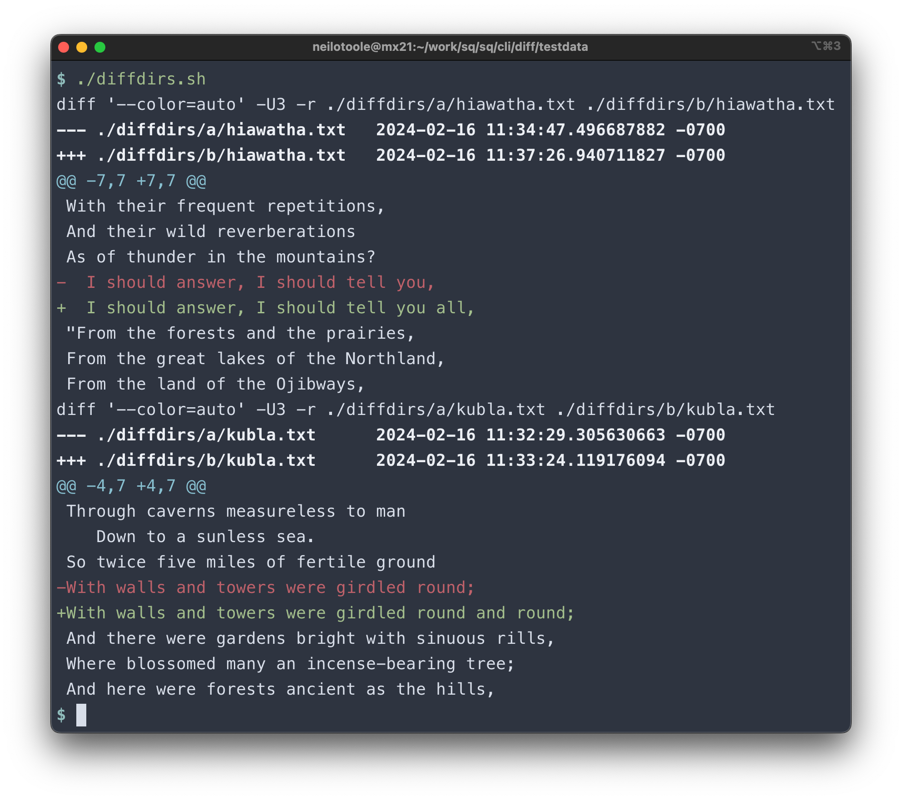

# `diff/testdata`

This dir contains testdata for the `sq` diff tests. It also contains scripts that execute
against GNU [`diff`](https://www.gnu.org/software/diffutils/manual/html_node/index.html)
to compare the output of `sq` with the `diff`'s output.


## diffdirs

[`diffdirs.sh`](diffdirs.sh) executes `diff` against two dirs.



Below is that same diff output, but inside a markdown `diff` block.

```diff
$ ./diffdirs.sh
diff '--color=auto' -U3 -r ./diffdirs/a/hiawatha.txt ./diffdirs/b/hiawatha.txt
--- ./diffdirs/a/hiawatha.txt	2024-02-16 11:34:47.496687882 -0700
+++ ./diffdirs/b/hiawatha.txt	2024-02-16 11:37:26.940711827 -0700
@@ -7,7 +7,7 @@
 With their frequent repetitions,
 And their wild reverberations
 As of thunder in the mountains?
-  I should answer, I should tell you,
+  I should answer, I should tell you all,
 "From the forests and the prairies,
 From the great lakes of the Northland,
 From the land of the Ojibways,
diff '--color=auto' -U3 -r ./diffdirs/a/kubla.txt ./diffdirs/b/kubla.txt
--- ./diffdirs/a/kubla.txt	2024-02-16 11:32:29.305630663 -0700
+++ ./diffdirs/b/kubla.txt	2024-02-16 11:33:24.119176094 -0700
@@ -4,7 +4,7 @@
 Through caverns measureless to man
    Down to a sunless sea.
 So twice five miles of fertile ground
-With walls and towers were girdled round;
+With walls and towers were girdled round and round;
 And there were gardens bright with sinuous rills,
 Where blossomed many an incense-bearing tree;
 And here were forests ancient as the hills,
```

## Hunk section

Here's how GitHub renders a hunk section in a markdown `diff` block.

```diff
@@ -4,7 +4,7 @@ Here's some context I've added.
 Through caverns measureless to man
    Down to a sunless sea.
 So twice five miles of fertile ground
-With walls and towers were girdled round;
+With walls and towers were girdled round and round;
```
