# Architecture

This document describes how `sq` is put together, with particular attention to SQL dialects and
the type system, which are the primary extension points for adding new database support.

`sq` supports eight SQL drivers (`sqlite3`, `rqlite`, `duckdb`, `postgres`, `sqlserver`, `mysql`,
`clickhouse`, `oracle`) and six document types (`csv`, `tsv`, `json`, `jsona`, `jsonl`, `xlsx`).
The full set is enumerated in
[`libsq/source/drivertype`](../libsq/source/drivertype/drivertype.go).

## Table of Contents

1. [Object Model](#object-model)
2. [Project Structure](#project-structure)
3. [SQL Dialects](#sql-dialects)
4. [Data Type System](#data-type-system)
5. [Driver Framework](#driver-framework)
6. [Query Building & Rendering](#query-building--rendering)
7. [Extension Guide](#extension-guide)
8. [Key Design Patterns](#key-design-patterns)
9. [File Reference](#file-reference)

---

## Object Model

The diagram below is effectively an ERD (Entity Relationship Diagram) of the key `sq` types and
how they relate.

```mermaid
classDiagram
    namespace cli {
        class `config.Config` {
            +string Version
            +source.Collection Collection
            +options.Options Options
        }

        class `options.Options` {
            <<typedef>>
            map~string,any~
        }

        class `run.Run` {
            +config.Config Config
            +driver.Grips Grips
            +driver.Registry Registry
            +output.Writers Writers
            +source.Collection Collection
        }

        class `output.Writers` {
            +RecordWriter Record
            +MetadataWriter Metadata
            +ErrorWriter Error
        }

        class `output.RecordWriter` {
            <<interface>>
            +Open(ctx, Meta) error
            +WriteRecords(ctx, []Record) error
            +Flush(ctx) error
            +Close(ctx) error
        }

        class `files.Files` {
            -map streams
            -map downloaders
            +NewReader(ctx, src) io.ReadCloser
            +Size(src) int64
            +Close() error
        }
    }

    namespace source {
        class `source.Collection` {
            -[]*Source sources
            -string ActiveSrc
            -string ActiveGroup
            +Sources() []*Source
            +Add(*Source)
            +Get(handle) *Source
            +Active() *Source
        }

        class `source.Source` {
            +string Handle
            +drivertype.Type Type
            +string Location
            +string Catalog
            +string Schema
            +options.Options Options
        }

        class `drivertype.Type` {
            <<enum>>
            string
        }
    }

    namespace driver {
        class `driver.Registry` {
            -map~Type,Provider~ providers
            +AddProvider(Type, Provider)
            +DriverFor(Type) Driver
            +SQLDriverFor(Type) SQLDriver
        }

        class `driver.Provider` {
            <<interface>>
            +DriverFor(Type) Driver
        }

        class `driver.Driver` {
            <<interface>>
            +Open(ctx, *Source) Grip
            +Ping(ctx, *Source) error
            +DriverMetadata() Metadata
            +ValidateSource(*Source) *Source
        }

        class `driver.SQLDriver` {
            <<interface>>
            +Dialect() Dialect
            +Renderer() *Renderer
            +CurrentSchema(ctx, db) string
            +ListSchemas(ctx, db) []string
        }

        class `driver.Grips` {
            -map~string,Grip~ grips
            -Provider drvrs
            +Open(ctx, *Source) Grip
            +Close() error
        }

        class `driver.Grip` {
            <<interface>>
            +DB(ctx) *sql.DB
            +Source() *Source
            +SQLDriver() SQLDriver
            +Close() error
        }

        class `dialect.Dialect` {
            +drivertype.Type Type
            +Placeholders func
            +Enquote func
            +int MaxBatchValues
            +bool SingleWriter
            +bool IntBool
            +bool Catalog
            +bool IsRowsAffectedUnsupported
        }
    }

    namespace drivers {
        class `sqlite3.driveri` {
            <<SQLDriver>>
        }
        class `rqlite.driveri` {
            <<SQLDriver>>
        }
        class `duckdb.driveri` {
            <<SQLDriver>>
        }
        class `postgres.driveri` {
            <<SQLDriver>>
        }
        class `sqlserver.driveri` {
            <<SQLDriver>>
        }
        class `mysql.driveri` {
            <<SQLDriver>>
        }
        class `clickhouse.driveri` {
            <<SQLDriver>>
        }
        class `oracle.driveri` {
            <<SQLDriver>>
        }
        class `csv.driveri` {
            <<Driver>>
        }
        class `json.driveri` {
            <<Driver>>
        }
        class `xlsx.Driver` {
            <<Driver>>
        }
    }

    namespace output {
        class `jsonw.stdWriter` {
            <<RecordWriter>>
        }
        class `jsonw.lineRecordWriter` {
            <<RecordWriter>>
        }
        class `csvw.RecordWriter` {
            <<RecordWriter>>
        }
        class `tablew.recordWriter` {
            <<RecordWriter>>
        }
        class `yamlw.recordWriter` {
            <<RecordWriter>>
        }
        class `htmlw.recordWriter` {
            <<RecordWriter>>
        }
        class `xmlw.recordWriter` {
            <<RecordWriter>>
        }
        class `xlsxw.recordWriter` {
            <<RecordWriter>>
        }
        class `markdownw.RecordWriter` {
            <<RecordWriter>>
        }
        class `raww.recordWriter` {
            <<RecordWriter>>
        }
    }

    namespace libsq {
        class `libsq.QueryContext` {
            +source.Collection Collection
            +driver.Grips Grips
            +*ast.AST AST
        }

        class `ast.AST` {
            +*ast.Segment Root
            +Segments() []*Segment
            +Tables() []*TblSelector
        }

        class `render.Renderer` {
            +Render(ctx, *AST) string
            +dialect Dialect
        }

        class `libsq.RecordWriter` {
            <<interface>>
            +Open(ctx, cancelFn, Meta) chan Record
            +Wait() written, error
        }
    }

    namespace metadata {
        class `metadata.Source` {
            +string Handle
            +drivertype.Type Driver
            +[]*Table Tables
            +string DBVersion
        }

        class `metadata.Table` {
            +string Name
            +string TableType
            +[]*Column Columns
            +int64 RowCount
        }

        class `metadata.Column` {
            +string Name
            +string ColumnType
            +kind.Kind Kind
            +bool Nullable
        }
    }

    namespace record {
        class `record.Record` {
            <<typedef>>
            []any
        }

        class `record.Meta` {
            <<typedef>>
            []*FieldMeta
            +Names() []string
            +Kinds() []kind.Kind
        }

        class `record.FieldMeta` {
            -ColumnTypeData data
            -string mungedName
            +Name() string
            +Kind() kind.Kind
            +Nullable() bool
        }

        class `kind.Kind` {
            <<enum>>
            Unknown
            Null
            Text
            Int
            Float
            Decimal
            Bool
            Bytes
            Datetime
            Date
            Time
        }
    }

    %% Notes (must be outside namespace blocks)
    note for `config.Config` "Core app config containing
     version, options, source collection"
    note for `options.Options` "Key-value pairs for
     CLI and driver settings"
    note for `run.Run` "CLI execution context with
     all injectable resources"
    note for `output.Writers` "Container for format-specific
     output writers (json, table, csv, etc.)"
    note for `drivertype.Type` "Driver type enum,
     e.g. postgres, mysql, sqlite3,
     sqlserver, csv, xlsx, json"
    note for `libsq.QueryContext` "Encapsulates context for
     SLQ query execution"
    note for `ast.AST` "Root of parsed SLQ
     query syntax tree"
    note for `render.Renderer` "Renders AST to SQL,
     customizable per dialect"
    note for `libsq.RecordWriter` "Interface for async record
     output via channels"
    note for `metadata.Source` "Database-level metadata
     (name, driver, tables)"
    note for `metadata.Table` "Table metadata
     (name, columns, row count)"
    note for `metadata.Column` "Column metadata
     (name, type, nullable)"
    note for `record.Record` "A Record represents a row
     of data from a query result"
    note for `record.Meta` "Meta holds column metadata
     for the columns of a Record"
    note for `record.FieldMeta` "FieldMeta provides metadata
     about a result column"
    note for `postgres.driveri` "SQL drivers implement SQLDriver;
     document drivers implement Driver only"
    note for `output.RecordWriter` "Synchronous interface for
     record output to various formats"
    note for `jsonw.stdWriter` "Output writers implement
     output.RecordWriter for various formats"
    note for `kind.Kind` "Unified data type abstraction
     across all database implementations"
    note for `dialect.Dialect` "SQL dialect-specific values
     and functions for rendering"
    note for `files.Files` "Centralized API for file access:
     local, stdin, and remote HTTP"

    %% ===== RELATIONSHIPS =====
    %% Configuration relationships
    `config.Config` *-- `source.Collection` : contains
    `config.Config` *-- `options.Options` : contains

    %% CLI relationships
    `run.Run` *-- `config.Config` : contains
    `run.Run` *-- `driver.Grips` : contains
    `run.Run` *-- `driver.Registry` : contains
    `run.Run` *-- `output.Writers` : contains

    %% Source relationships
    `source.Collection` "1" *-- "*" `source.Source` : contains
    `source.Source` --> "1" `drivertype.Type` : has

    %% Driver relationships
    `driver.Registry` --> `drivertype.Type` : indexes by
    `driver.Registry` ..|> `driver.Provider` : implements
    `driver.Registry` --> `driver.Driver` : creates
    `driver.SQLDriver` --|> `driver.Driver` : extends
    `driver.SQLDriver` ..> `record.Meta` : returns via RecordMeta()
    `driver.SQLDriver` --> `render.Renderer` : uses
    `driver.Driver` ..> `source.Source` : receives
    `driver.Driver` ..> `driver.Grip` : returns
    `driver.Grips` --> `driver.Provider` : uses
    `driver.Grips` --o `driver.Grip` : caches
    `driver.Grip` ..> `source.Source` : references
    `driver.Grip` ..> `driver.SQLDriver` : references
    `driver.Grip` ..> `metadata.Source` : returns

    %% Driver implementation relationships
    `sqlite3.driveri` ..|> `driver.SQLDriver` : implements
    `rqlite.driveri` ..|> `driver.SQLDriver` : implements
    `duckdb.driveri` ..|> `driver.SQLDriver` : implements
    `postgres.driveri` ..|> `driver.SQLDriver` : implements
    `sqlserver.driveri` ..|> `driver.SQLDriver` : implements
    `mysql.driveri` ..|> `driver.SQLDriver` : implements
    `clickhouse.driveri` ..|> `driver.SQLDriver` : implements
    `oracle.driveri` ..|> `driver.SQLDriver` : implements
    `csv.driveri` ..|> `driver.Driver` : implements
    `json.driveri` ..|> `driver.Driver` : implements
    `xlsx.Driver` ..|> `driver.Driver` : implements

    %% Output RecordWriter implementation relationships
    `jsonw.stdWriter` ..|> `output.RecordWriter` : implements
    `jsonw.lineRecordWriter` ..|> `output.RecordWriter` : implements
    `csvw.RecordWriter` ..|> `output.RecordWriter` : implements
    `tablew.recordWriter` ..|> `output.RecordWriter` : implements
    `yamlw.recordWriter` ..|> `output.RecordWriter` : implements
    `htmlw.recordWriter` ..|> `output.RecordWriter` : implements
    `xmlw.recordWriter` ..|> `output.RecordWriter` : implements
    `xlsxw.recordWriter` ..|> `output.RecordWriter` : implements
    `markdownw.RecordWriter` ..|> `output.RecordWriter` : implements
    `raww.recordWriter` ..|> `output.RecordWriter` : implements

    %% Query execution relationships
    `libsq.QueryContext` *-- `source.Collection` : contains
    `libsq.QueryContext` *-- `driver.Grips` : contains
    `libsq.QueryContext` --> `ast.AST` : uses
    `ast.AST` <.. `render.Renderer` : rendered by

    %% Metadata relationships
    `metadata.Source` "1" *-- "*" `metadata.Table` : contains
    `metadata.Table` "1" *-- "*" `metadata.Column` : contains

    %% Record relationships
    `record.Meta` "1" *-- "*" `record.FieldMeta` : contains
    `record.Meta` ..> `record.Record` : describes columns of

    %% Output relationships
    `libsq.RecordWriter` ..> `record.Record` : receives
    `libsq.RecordWriter` ..> `record.Meta` : uses
    `output.Writers` --> `output.RecordWriter` : contains
    `output.Writers` ..> `libsq.RecordWriter` : consumes

    %% Kind relationships
    `record.FieldMeta` --> `kind.Kind` : has
    `metadata.Column` --> `kind.Kind` : has

    %% Dialect relationships
    `driver.SQLDriver` --> `dialect.Dialect` : has
    `render.Renderer` --> `dialect.Dialect` : uses

    %% Files relationships
    `run.Run` *-- `files.Files` : contains
```



---

## Project Structure

```text
sq/
├── cli/                          # Command-line interface & commands
│   ├── run.go                    # Bootstrap & driver registration (FinishRunInit)
│   ├── cmd_*.go                  # Individual command implementations
│   ├── config/                   # Configuration management
│   └── output/                   # Output formatting
│
├── libsq/                        # Core library (main logic)
│   ├── driver/                   # Driver framework & registry
│   │   ├── driver.go             # Core Driver & SQLDriver interfaces
│   │   ├── registry.go           # Driver provider registry
│   │   ├── dialect/              # SQL dialect definitions
│   │   │   └── dialect.go        # Dialect struct & operations
│   │   └── grip.go               # Connection wrapper interface
│   │
│   ├── ast/                      # Abstract Syntax Tree
│   │   ├── ast.go                # Query AST structure
│   │   ├── parser.go             # Query parser
│   │   └── render/               # SQL code generator
│   │       ├── render.go         # Core rendering logic
│   │       ├── function.go       # Function rendering
│   │       └── selectcols.go     # SELECT clause rendering
│   │
│   ├── core/                     # Core utilities
│   │   ├── kind/                 # Data type abstraction layer
│   │   │   └── kind.go           # Generic Kind enum (Text, Int, Bool, etc.)
│   │   ├── sqlz/                 # SQL utilities
│   │   └── schema/               # Schema definitions
│   │
│   └── source/                   # Source definitions
│       └── drivertype/           # Driver type constants
│           └── drivertype.go     # Defines: SQLite, Rqlite, DuckDB, Pg, MSSQL, etc.
│
├── drivers/                      # Driver implementations
│   ├── sqlite3/                  # SQLite driver (embedded SQL)
│   │   ├── sqlite3.go            # Provider, driver & Dialect
│   │   └── metadata.go           # Both type mappings (kindFromDBTypeName, DBTypeForKind)
│   │
│   ├── duckdb/                   # DuckDB driver (embedded SQL)
│   │   ├── duckdb.go             # Provider & driver
│   │   ├── render.go             # Dialect
│   │   ├── metadata.go           # DBType→Kind (kindFromDBTypeName)
│   │   └── alter.go              # Kind→DBType (dbTypeNameFromKind)
│   │
│   ├── rqlite/                   # rqlite driver (SQLite SQL over HTTP)
│   │   ├── rqlite.go             # Provider, driver & Dialect
│   │   └── metadata.go           # Both type mappings (mirrors sqlite3)
│   │
│   ├── postgres/                 # PostgreSQL driver
│   │   ├── postgres.go           # Provider, driver & Dialect
│   │   ├── metadata.go           # DBType→Kind (kindFromDBTypeName)
│   │   └── render.go             # Kind→DBType (dbTypeNameFromKind)
│   │
│   ├── mysql/                    # MySQL driver
│   │   ├── mysql.go              # Provider, driver & Dialect
│   │   ├── metadata.go           # DBType→Kind
│   │   └── render.go             # Kind→DBType
│   │
│   ├── sqlserver/                # SQL Server driver
│   │   ├── sqlserver.go          # Provider, driver & Dialect
│   │   ├── metadata.go           # DBType→Kind
│   │   └── render.go             # Kind→DBType
│   │
│   ├── clickhouse/               # ClickHouse driver
│   │   ├── clickhouse.go         # Provider, driver & Dialect
│   │   ├── metadata.go           # DBType→Kind (kindFromClickHouseType)
│   │   └── render.go             # Kind→DBType
│   │
│   ├── oracle/                   # Oracle driver
│   │   ├── oracle.go             # Provider, driver & Dialect
│   │   ├── render.go             # Both type mappings & SQL rendering
│   │   └── metadata.go           # Schema extraction (data dictionary queries)
│   │
│   ├── csv/                      # CSV/TSV driver (document)
│   ├── json/                     # JSON/JSONA/JSONL driver (document)
│   ├── xlsx/                     # Excel driver (document)
│   └── userdriver/               # User-defined driver framework
│       └── xmlud/                # XML user driver implementation
│
└── testh/                        # Test helpers
```

> [!NOTE]
> SQLite and DuckDB are the two embedded SQL drivers: they read a local file and need no server.
> rqlite executes SQLite SQL but is a network service, so it is a client/server driver. See
> [DRIVERS.md](./DRIVERS.md).

---

## SQL Dialects

### Dialect Definition

**Location:** [`libsq/driver/dialect/dialect.go`](../libsq/driver/dialect/dialect.go)

The `Dialect` struct defines SQL dialect-specific behavior for each database. Each SQL driver
returns one from its `Dialect()` method.

```go
type Dialect struct {
    // Placeholders returns a string a SQL placeholders string.
    // For example "(?, ?, ?)" or "($1, $2, $3), ($4, $5, $6)".
    Placeholders func(numCols, numRows int) string

    // Enquote quotes and escapes an identifier (such as a table or
    // column name). Typically double-quote, although MySQL and
    // ClickHouse use backtick.
    Enquote func(string) string

    // ExecModeFor returns the ExecMode for a SQL string. The default
    // implementation is DefaultExecModeFor, which handles standard SQL.
    ExecModeFor func(sql string) (ExecMode, error)

    // Ops maps an SLQ operator (e.g. "==" or "!=") to its SQL rendering.
    // The default implementation is DefaultOps.
    Ops map[string]string

    // Type is the dialect's driver type.
    Type drivertype.Type

    // Joins is the set of JOIN types that the dialect supports. Not all
    // drivers support each join type: MySQL lacks jointype.FullOuter.
    Joins []jointype.Type

    // MaxBatchValues is the maximum number of values in a batch insert.
    MaxBatchValues int

    // SingleWriter indicates that a database of this dialect permits only
    // one write transaction at a time, so writers must be serialized.
    SingleWriter bool

    // IntBool is true if BOOLEAN is handled as an INT by the DB driver.
    IntBool bool

    // Catalog indicates that the database supports the catalog concept,
    // in addition to schema.
    Catalog bool

    // IsRowsAffectedUnsupported indicates that this dialect does not
    // reliably report rows affected via sql.Result.RowsAffected().
    IsRowsAffectedUnsupported bool
}
```

### Dialect Implementations

Every SQL driver implements `Dialect()`. The PostgreSQL implementation is representative:

**Location:** [`drivers/postgres/postgres.go`](../drivers/postgres/postgres.go), `driveri.Dialect`

```go
func (d *driveri) Dialect() dialect.Dialect {
	return dialect.Dialect{
		Type:           drivertype.Pg,
		Placeholders:   placeholders,
		Enquote:        stringz.DoubleQuote,
		MaxBatchValues: 1000,
		Ops:            dialect.DefaultOps(),
		ExecModeFor:    dialect.DefaultExecModeFor,
		Joins:          jointype.All(),
		Catalog:        true,
	}
}
```

The other seven follow the same shape; read them in `drivers/{driver}/`. The table below is the
authoritative cross-driver comparison.

### Dialect Comparison Table

| Driver     | Package               | Type Const              | Placeholders  | Enquote | Max Batch | IntBool | Catalog | Full Outer Join |
| ---------- | --------------------- | ----------------------- | ------------- | ------- | --------- | ------- | ------- | --------------- |
| SQLite     | `drivers/sqlite3/`    | `drivertype.SQLite`     | `?`           | `"`     | 500       | No      | No      | Yes             |
| rqlite     | `drivers/rqlite/`     | `drivertype.Rqlite`     | `?`           | `"`     | 500       | No      | No      | Yes             |
| DuckDB     | `drivers/duckdb/`     | `drivertype.DuckDB`     | `$1, $2...`   | `"`     | 1000      | No      | Yes     | Yes             |
| PostgreSQL | `drivers/postgres/`   | `drivertype.Pg`         | `$1, $2...`   | `"`     | 1000      | No      | Yes     | Yes             |
| SQL Server | `drivers/sqlserver/`  | `drivertype.MSSQL`      | `@p1, @p2...` | `"`     | 1000      | No      | Yes     | Yes             |
| MySQL      | `drivers/mysql/`      | `drivertype.MySQL`      | `?`           | `` ` `` | 250       | Yes     | No      | No              |
| ClickHouse | `drivers/clickhouse/` | `drivertype.ClickHouse` | `?`           | `` ` `` | 10000     | No      | No      | Yes             |
| Oracle     | `drivers/oracle/`     | `drivertype.Oracle`     | `:1, :2...`   | `"`     | 1000      | Yes     | No      | Yes             |

#### Dialect outliers

Three fields are set by exactly one driver each. They are easy to miss when adding a driver:

- **`SingleWriter`** is true only for **SQLite**. Its rollback journal serializes writers, so
  concurrent table copies (such as those populating a cross-source join DB) otherwise contend on
  the file lock and fail with "database is locked" ([#975](https://github.com/neilotoole/sq/issues/975)).
- **`IsRowsAffectedUnsupported`** is true only for **ClickHouse**, which always returns 0 from
  `sql.Result.RowsAffected()` for INSERT, UPDATE and DELETE because of protocol-level limits.
  Callers must read a 0 from `ExecSQL` as "unknown", not "zero rows".
- **`Enquote`** is a plain `stringz.DoubleQuote` for every driver except MySQL and ClickHouse
  (backtick) and **Oracle**, which double-quotes _and_ uppercases, because Oracle stores quoted
  identifiers case-sensitively while folding unquoted ones to uppercase.

---

## Data Type System

### Generic Type Abstraction (Kind)

**Location:** [`libsq/core/kind/kind.go`](../libsq/core/kind/kind.go)

The `Kind` type provides a generic abstraction over all data types. This is the canonical type
system that all drivers map to and from:

```go
type Kind int

const (
    Unknown  Kind = iota // 0: unknown kind
    Null                 // 1: NULL
    Text                 // 2: text/string
    Int                  // 3: integer
    Float                // 4: floating point
    Decimal              // 5: decimal
    Bool                 // 6: boolean
    Bytes                // 7: bytes/BLOB
    Datetime             // 8: date + time
    Date                 // 9: date only
    Time                 // 10: time only
)
```

### Type Mapping Architecture

Each SQL driver implements **bidirectional type mapping**:

1. **DB Type → Kind**: used during schema inspection, typically `kindFromDBTypeName`.
2. **Kind → DB Type**: used during table creation, typically `dbTypeNameFromKind`.

Two drivers deviate from those names: ClickHouse uses `kindFromClickHouseType`, and SQLite and
rqlite both export `DBTypeForKind` (the sqlite3 one is called by other packages). See the
[file reference](#file-reference) for where each lives.

#### Worked example: PostgreSQL

**DB Type → Kind.** The driver receives a database type name from the `database/sql` column
metadata and maps it onto a `Kind`. Excerpt from
[`drivers/postgres/metadata.go`](../drivers/postgres/metadata.go), `kindFromDBTypeName`:

```go
func kindFromDBTypeName(log *slog.Logger, colName, dbTypeName string) kind.Kind {
	var knd kind.Kind
	dbTypeName = strings.ToUpper(dbTypeName)

	switch dbTypeName {
	default:
		log.Warn(
			"Unknown Postgres column type: using alt type",
			lga.DBType, dbTypeName,
			lga.Col, colName,
			lga.Alt, kind.Unknown,
		)
		knd = kind.Unknown
	case "INT", "INTEGER", "INT2", "INT4", "INT8", "SMALLINT", "BIGINT":
		knd = kind.Int
	case "CHAR", "CHARACTER", "VARCHAR", "TEXT", "BPCHAR", "CHARACTER VARYING":
		knd = kind.Text
	case "BOOL", "BOOLEAN":
		knd = kind.Bool
	// ... remaining cases
	}

	return knd
}
```

**Kind → DB Type.** The reverse direction is a total function over `Kind`, used to emit DDL.
From [`drivers/postgres/render.go`](../drivers/postgres/render.go), `dbTypeNameFromKind`:

```go
func dbTypeNameFromKind(knd kind.Kind) string {
	switch knd { //nolint:exhaustive
	default:
		panic(fmt.Sprintf("unsupported datatype {%s}", knd))
	case kind.Unknown:
		return "TEXT"
	case kind.Text:
		return "TEXT"
	case kind.Int:
		return "BIGINT"
	case kind.Float:
		return "DOUBLE PRECISION"
	// ... remaining cases
	}
}
```

Alongside it, each driver keeps a `createTblKindDefaults` map supplying the `DEFAULT` clause per
`Kind`, because the sensible default is dialect-specific (Postgres uses `DEFAULT 'epoch'::date`
for `kind.Date`; Oracle cannot use `EMPTY_BLOB()` as a default at all).

#### Kind → native type, all drivers

This is what `dbTypeNameFromKind` (or `DBTypeForKind`) returns for each `Kind`:

| Kind       | SQLite     | rqlite     | DuckDB          | PostgreSQL         | SQL Server       | MySQL        | ClickHouse      | Oracle           |
| ---------- | ---------- | ---------- | --------------- | ------------------ | ---------------- | ------------ | --------------- | ---------------- |
| `Text`     | `TEXT`     | `TEXT`     | `VARCHAR`       | `TEXT`             | `NVARCHAR(MAX)`  | `TEXT`       | `String`        | `VARCHAR2(4000)` |
| `Int`      | `INTEGER`  | `INTEGER`  | `BIGINT`        | `BIGINT`           | `BIGINT`         | `INT`        | `Int64`         | `NUMBER(19,0)`   |
| `Float`    | `REAL`     | `REAL`     | `DOUBLE`        | `DOUBLE PRECISION` | `FLOAT`          | `DOUBLE`     | `Float64`       | `BINARY_DOUBLE`  |
| `Decimal`  | `NUMERIC`  | `NUMERIC`  | `DECIMAL(38,9)` | `DECIMAL`          | `DECIMAL`        | `DECIMAL`    | `Decimal(18,4)` | `NUMBER`         |
| `Bool`     | `BOOLEAN`  | `BOOLEAN`  | `BOOLEAN`       | `BOOLEAN`          | `BIT`            | `TINYINT(1)` | `Bool`          | `NUMBER(1,0)`    |
| `Bytes`    | `BLOB`     | `BLOB`     | `BLOB`          | `BYTEA`            | `VARBINARY(MAX)` | `BLOB`       | `String`        | `BLOB`           |
| `Datetime` | `DATETIME` | `DATETIME` | `TIMESTAMP`     | `TIMESTAMP`        | `DATETIME`       | `DATETIME`   | `DateTime`      | `TIMESTAMP`      |
| `Date`     | `DATE`     | `DATE`     | `DATE`          | `DATE`             | `DATE`           | `DATE`       | `Date`          | `DATE`           |
| `Time`     | `TIME`     | `TIME`     | `TIME`          | `TIME`             | `TIME`           | `TIME`       | `DateTime`      | `TIMESTAMP`      |

Notes on the gaps that table papers over:

- **No native `Time`.** ClickHouse and Oracle have no standalone time type, so both widen
  `kind.Time` to a datetime. Round-tripping a time-only value through either engine is lossy.
- **No native `Bool`.** SQL Server uses `BIT`; MySQL uses `TINYINT(1)`; Oracle emulates with
  `NUMBER(1,0)`. MySQL and Oracle therefore set `IntBool: true` in their dialect so that value
  scanning reads the column as an integer.
- **No native `Bytes`.** ClickHouse stores binary data as `String`.
- **`Unknown` and `Null`** are handled inconsistently by design. SQLite, rqlite, DuckDB,
  ClickHouse and Oracle fall back to their text type; PostgreSQL and SQL Server map `Unknown` to
  text but panic on `Null`; MySQL panics on both. A driver only meets `Null` or `Unknown` here if
  an earlier stage failed to resolve a column's kind, so the panic is a deliberate assertion.
- **Oracle `NUMBER`** is ambiguous on the wire: a computed `NUMBER` carries no precision or scale,
  so `kindFromDBTypeName` cannot tell an integer from a fractional value and returns
  `kind.Decimal`. See `kindFromOracleNumber` and
  [#844](https://github.com/neilotoole/sq/issues/844).

### Type System Integration Points

1. **Column Type Detection** (during schema inspection)
   - Driver queries database metadata
   - Converts DB-specific types to `Kind` using `kindFromDBTypeName()`
   - Stores in schema metadata

2. **Table Creation**
   - Input: `schema.Table` with `Col.Kind` values
   - Uses `dbTypeNameFromKind()` to generate CREATE TABLE DDL
   - Each driver generates its own SQL dialect

3. **Value Scanning**
   - `RecordMeta()` creates scanners based on column `Kind`
   - Handles database-specific quirks (e.g., MySQL BOOLEAN as INT)

---

## Driver Framework

### Core Interfaces

**Location:** [`libsq/driver/driver.go`](../libsq/driver/driver.go)

#### Provider Interface (Factory Pattern)

```go
type Provider interface {
    // DriverFor creates a Driver instance for the given type
    DriverFor(typ drivertype.Type) (Driver, error)
}
```

Each driver package implements a `Provider` struct that acts as a factory.

#### Driver Interface (Base)

```go
type Driver interface {
    // Open opens a connection to the data source
    Open(ctx context.Context, src *source.Source) (Grip, error)

    // Ping verifies connectivity to the data source
    Ping(ctx context.Context, src *source.Source) error

    // DriverMetadata returns metadata about the driver
    DriverMetadata() Metadata

    // ValidateSource validates and normalizes a source
    ValidateSource(src *source.Source) (*source.Source, error)
}
```

#### SQLDriver Interface (SQL-specific)

```go
type SQLDriver interface {
    Driver

    // Dialect returns the SQL dialect for this driver
    Dialect() dialect.Dialect

    // Renderer returns the SQL renderer with any overrides
    Renderer() *render.Renderer

    // Schema operations
    CurrentSchema(ctx context.Context, db sqlz.DB) (string, error)
    ListSchemas(ctx context.Context, db sqlz.DB) ([]string, error)

    // Metadata operations
    TableColumnTypes(ctx context.Context, db sqlz.DB, tblName string) ([]*sql.ColumnType, error)
    RecordMeta(ctx context.Context, colTypes []*sql.ColumnType) (record.Meta, NewRecordFunc, error)

    // DDL operations
    CreateTable(ctx context.Context, db sqlz.DB, tblDef *schema.Table) error
    AlterTableAddColumn(ctx context.Context, db sqlz.DB, tblName, colName string, knd kind.Kind) error
    DropTable(ctx context.Context, db sqlz.DB, tbl string, ifExists bool) error

    // Insert operations
    PrepareInsertStmt(ctx context.Context, db sqlz.DB, destTbl string,
                     destCols []string, numRows int) (*StmtExecer, error)
    PrepareUpdateStmt(ctx context.Context, db sqlz.DB, destTbl string,
                     destCols []string, where string) (*StmtExecer, error)

    // ... 10+ other methods for various SQL operations
}
```

### Driver Registration

**Location:** [`cli/run.go`](../cli/run.go), `FinishRunInit`

Driver providers are registered during application bootstrap. Every driver `sq` ships is wired up
here, so this function is the definitive list:

```go
func FinishRunInit(ctx context.Context, ru *run.Run) error {
	// ... setup elided

	ru.DriverRegistry = driver.NewRegistry(log)
	dr := ru.DriverRegistry

	ru.Grips = driver.NewGrips(dr, ru.Files, ru.SecretRegistry, scratchSrcFunc)

	// SQL drivers.
	dr.AddProvider(drivertype.SQLite, &sqlite3.Provider{Log: log})
	dr.AddProvider(drivertype.Rqlite, &rqlite.Provider{Log: log})
	dr.AddProvider(drivertype.DuckDB, &duckdb.Provider{Log: log})
	dr.AddProvider(drivertype.Pg, &postgres.Provider{Log: log})
	dr.AddProvider(drivertype.MSSQL, &sqlserver.Provider{Log: log})
	dr.AddProvider(drivertype.MySQL, &mysql.Provider{Log: log})
	dr.AddProvider(drivertype.ClickHouse, &clickhouse.Provider{Log: log})
	dr.AddProvider(drivertype.Oracle, &oracle.Provider{Log: log})

	// Document drivers. Note that one provider can serve several types,
	// and that each registers a detector so that `sq add` can infer the
	// type from the file itself.
	csvp := &csv.Provider{Log: log, Ingester: ru.Grips, Files: ru.Files}
	dr.AddProvider(drivertype.CSV, csvp)
	dr.AddProvider(drivertype.TSV, csvp)
	ru.Files.AddDriverDetectors(csv.DetectCSV, csv.DetectTSV)

	jsonp := &json.Provider{Log: log, Ingester: ru.Grips, Files: ru.Files}
	dr.AddProvider(drivertype.JSON, jsonp)
	dr.AddProvider(drivertype.JSONA, jsonp)
	dr.AddProvider(drivertype.JSONL, jsonp)
	sampleSize := driver.OptIngestSampleSize.Get(cfg.Options)
	ru.Files.AddDriverDetectors(
		json.DetectJSON(sampleSize),
		json.DetectJSONA(sampleSize),
		json.DetectJSONL(sampleSize),
	)

	dr.AddProvider(drivertype.XLSX, &xlsx.Provider{Log: log, Ingester: ru.Grips, Files: ru.Files})
	ru.Files.AddDriverDetectors(xlsx.DetectXLSX)

	// User-defined drivers, from config.
	for _, udd := range cfg.Ext.UserDrivers {
		// ...
		ru.DriverRegistry.AddProvider(drivertype.Type(udd.Name), udp)
	}

	return nil
}
```

SQL drivers take only a logger. Document drivers additionally take an `Ingester` and `Files`,
because they ingest into a scratch database rather than querying in place.

### Example: PostgreSQL Driver Structure

**Location:** [`drivers/postgres/postgres.go`](../drivers/postgres/postgres.go)

```go
// Provider is the factory
type Provider struct {
    Log *slog.Logger
}

func (p *Provider) DriverFor(typ drivertype.Type) (driver.Driver, error) {
    if typ != drivertype.Pg {
        return nil, errz.Errorf("unsupported driver type {%s}", typ)
    }
    return &driveri{log: p.Log}, nil
}

// driveri implements SQLDriver interface
type driveri struct {
    log *slog.Logger
}

// SQLDriver method implementations
func (d *driveri) DriverMetadata() driver.Metadata {
    return driver.Metadata{
        Type:        drivertype.Pg,
        Description: "PostgreSQL",
        Doc:         "https://github.com/jackc/pgx",
        IsSQL:       true,
        DefaultPort: 5432,
    }
}

func (d *driveri) Dialect() dialect.Dialect {
    // Returns PostgreSQL-specific dialect (see SQL Dialects section)
}

func (d *driveri) Renderer() *render.Renderer {
    r := render.NewDefaultRenderer()
    // Customize function names
    r.FunctionNames[ast.FuncNameSchema] = "current_schema"
    r.FunctionNames[ast.FuncNameCatalog] = "current_database"
    return r
}

func (d *driveri) Open(ctx context.Context, src *source.Source,
    _ driver.AccessMode) (driver.Grip, error) {
    // Opens PostgreSQL connection
}

func (d *driveri) CreateTable(ctx context.Context, db sqlz.DB, tblDef *schema.Table) error {
    // Generates and executes CREATE TABLE statement
}

// ... 20+ other SQLDriver methods
```

---

## Query Building & Rendering

### AST (Abstract Syntax Tree)

**Location:** `libsq/ast/ast.go`

`sq` parses queries into an AST structure:

```text
SelectNode (root)
  ├─ TblSelectorNode (FROM table)
  ├─ Columns (SELECT columns)
  │   ├─ ColSelectorNode
  │   └─ FuncNode
  ├─ WhereNode (WHERE conditions)
  │   └─ OperatorNode
  ├─ GroupByNode (GROUP BY)
  ├─ HavingNode (HAVING)
  ├─ OrderByNode (ORDER BY)
  │   └─ OrderByTermNode
  ├─ JoinNode[] (JOINs)
  │   ├─ JoinConstraintNode
  │   └─ TblSelectorNode
  └─ RowRangeNode (LIMIT/OFFSET)

ExprNode (expressions)
  ├─ FuncNode (function calls)
  ├─ OperatorNode (operators)
  ├─ LiteralNode (values)
  └─ SelectorNode (columns)
```

### Renderer (AST → SQL)

**Location:** `libsq/ast/render/render.go`

The `Renderer` struct holds dialect-specific rendering functions:

```go
type Renderer struct {
    // Dialect provides DB-specific operations
    Dialect dialect.Dialect

    // FunctionNames maps AST function names to SQL function names
    // e.g., FuncNameSchema → "current_schema" (Postgres) or "DATABASE" (MySQL)
    FunctionNames map[string]string

    // FunctionOverrides provides custom function rendering
    FunctionOverrides map[string]FuncRenderer

    // Other rendering customizations
    // ...
}

type FuncRenderer func(ctx *Context, fn *ast.FuncNode) (string, error)
```

#### Rendering Process

1. **Parse Query** → AST (SLQ syntax → SelectNode tree)
2. **Build Context** → Includes dialect, args, fragments
3. **Render Fragments**:
   - Columns → `SelectCols()`
   - From → `FromTable()`
   - Where → `Where()`
   - Joins → `Join()`
   - Group By → `GroupBy()`
   - Order By → `OrderBy()`
4. **Assemble SQL** → Combine fragments into final SQL string

#### Custom Rendering per Driver

Each driver can customize the renderer by overriding function names or supplying a render func.

**PostgreSQL** ([`drivers/postgres/postgres.go`](../drivers/postgres/postgres.go), `driveri.Renderer`):

```go
func (d *driveri) Renderer() *render.Renderer {
	r := render.NewDefaultRenderer()
	r.FunctionNames[ast.FuncNameSchema] = "current_schema"
	r.FunctionNames[ast.FuncNameCatalog] = "current_database"
	// avg() returns a portable float64 instead of Postgres's native numeric
	// (which sq surfaces as a decimal.Decimal). See issue #594.
	r.FunctionOverrides[ast.FuncNameAvg] = render.FuncOverrideCastResult("DOUBLE PRECISION")
	// ... further overrides
	return r
}
```

**MySQL** ([`drivers/mysql/mysql.go`](../drivers/mysql/mysql.go), `driveri.Renderer`):

```go
func (d *driveri) Renderer() *render.Renderer {
	r := render.NewDefaultRenderer()
	r.FunctionNames[ast.FuncNameSchema] = "DATABASE"
	r.FunctionOverrides[ast.FuncNameAvg] = renderFuncAvg
	// ... further overrides
	return r
}
```

**SQLite** and **rqlite** go further: neither engine has a real schema or catalog concept, so both
substitute a SQL fragment for `schema()` rather than renaming a function:

```go
const schemaFrag = `(SELECT name FROM pragma_database_list ORDER BY seq limit 1)`
r.FunctionOverrides[ast.FuncNameSchema] = render.FuncOverrideString(schemaFrag)
```

This lets each database have its own SQL generation logic while sharing the common AST structure.
Overrides also carry cross-driver harmonization: `avg()` is cast to a float and `sum()` to a
decimal on the engines whose native return type would otherwise differ (issues
[#594](https://github.com/neilotoole/sq/issues/594) and
[#839](https://github.com/neilotoole/sq/issues/839)).

---

## Extension Guide

### Adding a New SQL Database Driver

This guide walks the [`oracle`](../drivers/oracle) driver, which is a good reference because it is
the most recently added SQL driver and has to work around more engine quirks than most. Read it
alongside the source; every excerpt below is real code, so when the two disagree, the source wins.

For the full list of artifacts a new driver must ship (not just code), see the
[driver ship checklist](DRIVERS.md#driver-ship-checklist) in DRIVERS.md.

#### Step 1: Create the driver package

```text
drivers/oracle/
├── oracle.go      # Provider, driveri, DriverMetadata, Dialect, Open
├── grip.go        # Grip implementation (connection wrapper)
├── metadata.go    # Schema introspection via the data dictionary
├── render.go      # Both type mappings & SQL rendering
├── errors.go      # Driver-specific error wrapping
├── internal_test.go # Exports unexported funcs to the external test package
└── oracle_test.go   # Integration tests
```

See [DRIVERS.md](DRIVERS.md#package-structure) for the conventional package layout and the
`internal_test.go` export pattern.

#### Step 2: Define the driver type

**File:** [`libsq/source/drivertype/drivertype.go`](../libsq/source/drivertype/drivertype.go)

```go
// Oracle is for Oracle Database.
Oracle = Type("oracle")
```

The string value is load-bearing: it is the value shown by `sq driver ls`, the connection URL
scheme, and the `sakiladb/{driver}` Docker image name.

#### Step 3: Implement Provider and Driver

**File:** [`drivers/oracle/oracle.go`](../drivers/oracle/oracle.go)

The `Provider` is a factory that returns a driver for its one type:

```go
type Provider struct {
	Log *slog.Logger
}

// DriverFor implements driver.Provider.
func (p *Provider) DriverFor(typ drivertype.Type) (driver.Driver, error) {
	if typ != drivertype.Oracle {
		return nil, errz.Errorf("unsupported driver type {%s}", typ)
	}

	return &driveri{log: p.Log}, nil
}

var _ driver.SQLDriver = (*driveri)(nil)

// driveri is the Oracle implementation of driver.Driver.
type driveri struct {
	log *slog.Logger
}
```

`DriverMetadata` describes the driver to `sq driver ls`:

```go
func (d *driveri) DriverMetadata() driver.Metadata {
	return driver.Metadata{
		Type:        drivertype.Oracle,
		Description: "Oracle",
		Doc:         "https://github.com/sijms/go-ora",
		IsSQL:       true,
		DefaultPort: 1521,
	}
}
```

`Dialect` is covered in [SQL Dialects](#sql-dialects) above. `Open` connects, pings to capture the
server version, and wraps the handle in a `Grip`:

```go
func (d *driveri) Open(ctx context.Context, src *source.Source, _ driver.AccessMode) (driver.Grip, error) {
	lg.FromContext(ctx).Debug(lgm.OpenSrc, lga.Src, src)

	db, err := d.doOpen(ctx, src)
	if err != nil {
		return nil, err
	}

	ver, err := driver.OpeningPing(ctx, src, db, d.DBSemver)
	if err != nil {
		return nil, err
	}

	g := &grip{log: d.log, db: db, src: src, drvr: d}
	g.semver.Prime(ver)
	return g, nil
}
```

> [!NOTE]
> `Open` takes a `driver.AccessMode`. The Oracle driver ignores it (hence the `_`), but embedded
> file-based drivers such as DuckDB use it to open read-only versus read-write.

#### Step 4: Define the type mapping

**File:** [`drivers/oracle/render.go`](../drivers/oracle/render.go)

Implement both directions, as described in
[Type Mapping Architecture](#type-mapping-architecture). Oracle shows why this is rarely a flat
lookup: `NUMBER` carries no precision or scale when it is computed, so `kindFromDBTypeName`
delegates to `kindFromOracleNumber` and falls back to `kind.Decimal`
([#844](https://github.com/neilotoole/sq/issues/844)).

```go
func kindFromDBTypeName(log *slog.Logger, colName, dbTypeName string) kind.Kind {
	dbTypeName = strings.ToUpper(dbTypeName)

	// NUMBER's kind depends on its precision/scale, so it's parsed
	// specially before the generic param-strip below.
	if strings.HasPrefix(dbTypeName, "NUMBER(") {
		return kindFromOracleNumber(dbTypeName)
	}

	// Strip parameter parens so e.g. "VARCHAR2(91)" or
	// "TIMESTAMP(6) WITH TIME ZONE" match their bare form below.
	dbTypeName = stripTypeParams(dbTypeName)

	switch dbTypeName {
	case "VARCHAR2", "NVARCHAR2", "CHAR", "NCHAR", "VARCHAR", "LONG", "LONGVARCHAR":
		return kind.Text
	// ... remaining cases
	}
}
```

The reverse direction must cover every `Kind`, substituting where the engine has no native type:

```go
func dbTypeNameFromKind(knd kind.Kind) string {
	switch knd {
	case kind.Bool:
		// Oracle has no native BOOLEAN type, use NUMBER(1,0)
		return "NUMBER(1,0)"
	case kind.Time:
		// Oracle has no standalone TIME type, use TIMESTAMP
		return "TIMESTAMP"
	// ... remaining cases
	}
	return "VARCHAR2(4000)"
}
```

When you substitute like this, check whether the dialect needs a matching flag. Because Oracle
emulates `BOOLEAN` as `NUMBER(1,0)`, its dialect sets `IntBool: true` so value scanning reads the
column as an integer.

#### Step 5: Register the driver

**File:** [`cli/run.go`](../cli/run.go), in `FinishRunInit`

```go
import "github.com/neilotoole/sq/drivers/oracle"

dr.AddProvider(drivertype.Oracle, &oracle.Provider{Log: log})
```

Unlike document drivers, a SQL driver's provider needs no `Ingester` or `Files`, because it
queries the source in place rather than ingesting it into a scratch database.

#### Step 6: Testing

Drivers are tested through the `testh` harness. See [DRIVERS.md](DRIVERS.md) and
[SAKILA.md](SAKILA.md); for SQL drivers this means a `sakiladb/{driver}` image carrying the Sakila
dataset, so the same integration suite runs against every engine.

Unexported functions such as `kindFromDBTypeName` are reached from the external test package via
the `internal_test.go` export pattern documented in
[DRIVERS.md](DRIVERS.md#test-file-organization).

#### Step 7: Documentation and agent skill

Complete the [driver ship checklist](DRIVERS.md#driver-ship-checklist): an sq.io page under
`site/content/en/docs/drivers/`, plus `skills/sq/references/{driver}.md` and an entry in
`skills/sq/SKILL.md`.

### Adding a New Data Type

To add support for a new data type (e.g., `UUID`, `JSON`, `Geometry`):

#### Step 1: Add to Kind Enum

**File:** `libsq/core/kind/kind.go`

```go
const (
    Unknown Kind = iota // 0
    Null                // 1
    // ... existing kinds, through Time (10)
    UUID                // 11: new kind
    Geometry            // 12: another new kind
)

func (k Kind) String() string {
    switch k {
    // ... existing cases
    case UUID:
        return "uuid"
    case Geometry:
        return "geometry"
    default:
        return "unknown"
    }
}

func (k Kind) MarshalText() ([]byte, error) {
    // Add marshaling for new types
    switch k {
    case UUID:
        return []byte("uuid"), nil
    case Geometry:
        return []byte("geometry"), nil
    // ... existing cases
    }
}
```

#### Step 2: Update Each Driver

For **each** SQL driver, update the type mapping functions:

**PostgreSQL** (`drivers/postgres/metadata.go`):

```go
func kindFromDBTypeName(log *slog.Logger, colName, dbTypeName string) kind.Kind {
    switch strings.ToUpper(dbTypeName) {
    // ... existing cases
    case "UUID":
        return kind.UUID
    case "GEOMETRY", "GEOGRAPHY":
        return kind.Geometry
    // ... rest of cases
    }
}
```

**PostgreSQL** (`drivers/postgres/render.go`):

```go
func dbTypeNameFromKind(knd kind.Kind) string {
    switch knd {
    // ... existing cases
    case kind.UUID:
        return "UUID"
    case kind.Geometry:
        return "GEOMETRY"
    // ... rest of cases
    }
}
```

**MySQL** (`drivers/mysql/metadata.go`):

```go
func kindFromDBTypeName(colName, dbTypeName string) kind.Kind {
    dbTypeName = strings.ToUpper(dbTypeName)
    switch {
    // ... existing cases
    case strings.HasPrefix(dbTypeName, "UUID"):
        return kind.UUID
    case strings.HasPrefix(dbTypeName, "GEOMETRY"),
         strings.HasPrefix(dbTypeName, "POINT"),
         strings.HasPrefix(dbTypeName, "POLYGON"):
        return kind.Geometry
    // ... rest of cases
    }
}
```

**MySQL** (`drivers/mysql/render.go`):

```go
func dbTypeNameFromKind(knd kind.Kind) string {
    switch knd {
    // ... existing cases
    case kind.UUID:
        return "VARCHAR(36)"  // MySQL doesn't have native UUID
    case kind.Geometry:
        return "GEOMETRY"
    // ... rest of cases
    }
}
```

Repeat for every SQL driver: `sqlite3`, `rqlite`, `duckdb`, `postgres`, `sqlserver`, `mysql`,
`clickhouse` and `oracle`. A new `Kind` is only as good as its least-complete driver, so an engine
with no native equivalent still needs a deliberate substitution (as Oracle does for `kind.Bool`)
rather than being skipped.

#### Step 3: Update Value Scanning

If the new type requires special scanning logic, update:

**File:** `drivers/postgres/metadata.go` (or respective driver)

```go
func (d *driveri) RecordMeta(ctx context.Context,
                             colTypes []*sql.ColumnType) (record.Meta, NewRecordFunc, error) {
    // ... existing code

    for i, colType := range colTypes {
        knd := kindFromDBTypeName(d.log, colType.Name(), colType.DatabaseTypeName())

        // Special handling for new types
        switch knd {
        case kind.UUID:
            scanDests[i] = &sql.NullString{}  // Scan as string
        case kind.Geometry:
            scanDests[i] = &[]byte{}  // Scan as bytes
        default:
            // ... existing logic
        }
    }
}
```

### Adding a Non-SQL Document Driver

Document drivers do not execute queries against the source. They **ingest** it into a scratch
database and hand back a `Grip` pointing at that. This guide walks the [`csv`](../drivers/csv)
driver, which is the simplest complete example; [`json`](../drivers/json) and
[`xlsx`](../drivers/xlsx) follow the same shape.

#### Step 1: Create the driver package

```text
drivers/csv/
├── csv.go                  # Provider, driveri, DriverMetadata, Open
├── ingest.go               # Reads the source into the scratch DB
├── insert.go               # Batch insert machinery
├── detect_type.go          # DetectCSV / DetectTSV (files.TypeDetectFunc)
├── detect_header.go        # Header-row heuristic
├── detect_field_kinds.go   # Per-column kind.Kind inference
└── csv_test.go             # Tests
```

#### Step 2: Implement the driver

**File:** [`drivers/csv/csv.go`](../drivers/csv/csv.go)

A document `Provider` takes an `Ingester` and `Files` in addition to the logger. One provider can
serve several driver types; the CSV provider serves both `csv` and `tsv`:

```go
type Provider struct {
	Log      *slog.Logger
	Ingester driver.GripOpenIngester
	Files    *files.Files
}

// DriverFor implements driver.Provider.
func (d *Provider) DriverFor(typ drivertype.Type) (driver.Driver, error) {
	switch typ { //nolint:exhaustive
	case drivertype.CSV:
		return &driveri{log: d.Log, typ: drivertype.CSV, ingester: d.Ingester, files: d.Files}, nil
	case drivertype.TSV:
		return &driveri{log: d.Log, typ: drivertype.TSV, ingester: d.Ingester, files: d.Files}, nil
	}

	return nil, errz.Errorf("unsupported driver type {%s}", typ)
}
```

Because one `driveri` serves two types, it carries its type and branches in `DriverMetadata`.
Note `Monotable: true`: a CSV file is a single table, unlike a SQL source or an XLSX workbook.

```go
func (d *driveri) DriverMetadata() driver.Metadata {
	md := driver.Metadata{Type: d.typ, Monotable: true}
	if d.typ == drivertype.CSV {
		md.Description = "Comma-Separated Values"
		md.Doc = "https://en.wikipedia.org/wiki/Comma-separated_values"
	} else {
		md.Description = "Tab-Separated Values"
		md.Doc = "https://en.wikipedia.org/wiki/Tab-separated_values"
	}
	return md
}
```

`Open` is where document drivers diverge from SQL drivers. Rather than connecting, it hands an
ingest func to `OpenIngest`, which manages the scratch database and the ingest cache:

```go
func (d *driveri) Open(ctx context.Context, src *source.Source, _ driver.AccessMode) (driver.Grip, error) {
	log := lg.FromContext(ctx)
	log.Debug(lgm.OpenSrc, lga.Src, src)

	g := &grip{
		log:   d.log,
		src:   src,
		files: d.files,
	}

	allowCache := driver.OptIngestCache.Get(options.FromContext(ctx))

	ingestFn := func(ctx context.Context, destGrip driver.Grip) error {
		log.Debug("Ingest func invoked", lga.Src, src)
		return d.ingestCSV(ctx, src, destGrip)
	}

	var err error
	if g.impl, err = d.ingester.OpenIngest(ctx, src, allowCache, ingestFn); err != nil {
		return nil, err
	}

	return g, nil
}
```

Note that a document driver implements `driver.Driver`, not `driver.SQLDriver`: it has no
`Dialect` and no `Kind`→DB-type mapping of its own. The scratch database it ingests into supplies
those. What it does need is the opposite inference, guessing a `kind.Kind` per column from the
raw data, which is what `detect_field_kinds.go` does.

#### Step 3: Implement detection

**File:** [`drivers/csv/detect_type.go`](../drivers/csv/detect_type.go)

Detection lets `sq add` infer a source's type from the file itself. A detector implements
`files.TypeDetectFunc` and returns a type plus a confidence score, so that competing detectors can
be ranked:

```go
var (
	_ files.TypeDetectFunc = DetectCSV
	_ files.TypeDetectFunc = DetectTSV
)

// DetectCSV implements files.TypeDetectFunc.
func DetectCSV(ctx context.Context, newRdrFn files.NewReaderFunc) (detected drivertype.Type, score float32,
	err error,
) {
	return detectType(ctx, drivertype.CSV, newRdrFn)
}
```

The shared `detectType` opens a reader, parses a sample with the appropriate delimiter, and scores
the result. A format with magic bytes (as XLSX has) can be far more decisive than CSV, which has
to guess from structure.

#### Step 4: Register the driver

**File:** [`cli/run.go`](../cli/run.go), in `FinishRunInit`

Register the provider for each type it serves, then register its detectors:

```go
csvp := &csv.Provider{Log: log, Ingester: ru.Grips, Files: ru.Files}
dr.AddProvider(drivertype.CSV, csvp)
dr.AddProvider(drivertype.TSV, csvp)
ru.Files.AddDriverDetectors(csv.DetectCSV, csv.DetectTSV)
```

---

## Key Design Patterns

### 1. Provider/Factory Pattern

- `Provider` interface creates `Driver` instances
- Enables lazy instantiation and polymorphism
- Supports dependency injection

### 2. Strategy Pattern (Dialect)

- `Dialect` encapsulates database-specific behavior
- Placeholders, quoting, operators vary by database
- Renderer uses Dialect for code generation

### 3. Adapter Pattern (Kind)

- `Kind` provides universal type abstraction
- Each driver adapts DB types ↔ Kind
- Enables cross-database operations

### 4. Template Method (Rendering)

- Base `Renderer` provides structure
- Drivers override specific methods
- Flexible for future extensions

### 5. Bridge Pattern (Grip)

- `Grip` decouples driver from connection
- Allows multiple connection implementations
- Supports caching, pooling, transformation

---

## File Reference

Symbol names are given instead of line numbers, because line numbers go stale on the next edit.

### Core framework

| Component           | File                                                                                | Symbol                |
| ------------------- | ----------------------------------------------------------------------------------- | --------------------- |
| Dialect struct      | [`libsq/driver/dialect/dialect.go`](../libsq/driver/dialect/dialect.go)             | `Dialect`             |
| Kind enum           | [`libsq/core/kind/kind.go`](../libsq/core/kind/kind.go)                             | `Kind`                |
| Driver interfaces   | [`libsq/driver/driver.go`](../libsq/driver/driver.go)                               | `Driver`, `SQLDriver` |
| Driver registry     | [`libsq/driver/registry.go`](../libsq/driver/registry.go)                           | `Registry`            |
| Driver types enum   | [`libsq/source/drivertype/drivertype.go`](../libsq/source/drivertype/drivertype.go) | `Type`                |
| Driver registration | [`cli/run.go`](../cli/run.go)                                                       | `FinishRunInit`       |
| Renderer struct     | [`libsq/ast/render/render.go`](../libsq/ast/render/render.go)                       | `Renderer`            |
| AST definitions     | [`libsq/ast/ast.go`](../libsq/ast/ast.go)                                           | `AST`                 |
| Query parser        | [`libsq/ast/parser.go`](../libsq/ast/parser.go)                                     | `parseSLQ`            |

### Per-driver: dialect and type mapping

`Dialect` is always the `driveri.Dialect` method in the listed file.

| Driver     | Dialect                            | DBType→Kind                             | Kind→DBType                       |
| ---------- | ---------------------------------- | --------------------------------------- | --------------------------------- |
| SQLite     | `drivers/sqlite3/sqlite3.go`       | `metadata.go`, `kindFromDBTypeName`     | `metadata.go`, `DBTypeForKind`    |
| rqlite     | `drivers/rqlite/rqlite.go`         | `metadata.go`, `kindFromDBTypeName`     | `metadata.go`, `DBTypeForKind`    |
| DuckDB     | `drivers/duckdb/render.go`         | `metadata.go`, `kindFromDBTypeName`     | `alter.go`, `dbTypeNameFromKind`  |
| PostgreSQL | `drivers/postgres/postgres.go`     | `metadata.go`, `kindFromDBTypeName`     | `render.go`, `dbTypeNameFromKind` |
| SQL Server | `drivers/sqlserver/sqlserver.go`   | `metadata.go`, `kindFromDBTypeName`     | `render.go`, `dbTypeNameFromKind` |
| MySQL      | `drivers/mysql/mysql.go`           | `metadata.go`, `kindFromDBTypeName`     | `render.go`, `dbTypeNameFromKind` |
| ClickHouse | `drivers/clickhouse/clickhouse.go` | `metadata.go`, `kindFromClickHouseType` | `render.go`, `dbTypeNameFromKind` |
| Oracle     | `drivers/oracle/oracle.go`         | `render.go`, `kindFromDBTypeName`       | `render.go`, `dbTypeNameFromKind` |

Paths in the last two columns are relative to the driver's own package directory.

---

## Summary

The `sq` architecture is built on several key principles:

1. **Universal Type Abstraction**: The `Kind` enum provides a common type system that all
   drivers map to, enabling cross-database compatibility.

2. **Dialect-Aware Rendering**: Each database defines its `Dialect` with specific placeholder
   styles, quoting rules, and operator mappings. The renderer uses these to generate correct SQL.

3. **Pluggable Driver System**: The Provider/Factory pattern with centralized registration makes
   it easy to add new databases and document formats.

4. **Bidirectional Type Mapping**: Every SQL driver implements both DB Type → Kind and Kind → DB
   Type conversions, ensuring seamless data flow.

5. **Clean Separation of Concerns**:
   - **AST**: Query structure (database-agnostic)
   - **Dialect**: Database-specific syntax rules
   - **Driver**: Database-specific implementation
   - **Renderer**: SQL code generation

To extend `sq` with new databases or types, follow the patterns established in existing drivers,
focusing on the three critical components: **Dialect definition**, **Type mapping**, and
**Driver implementation**.
