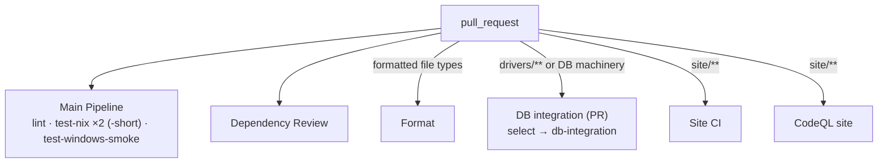
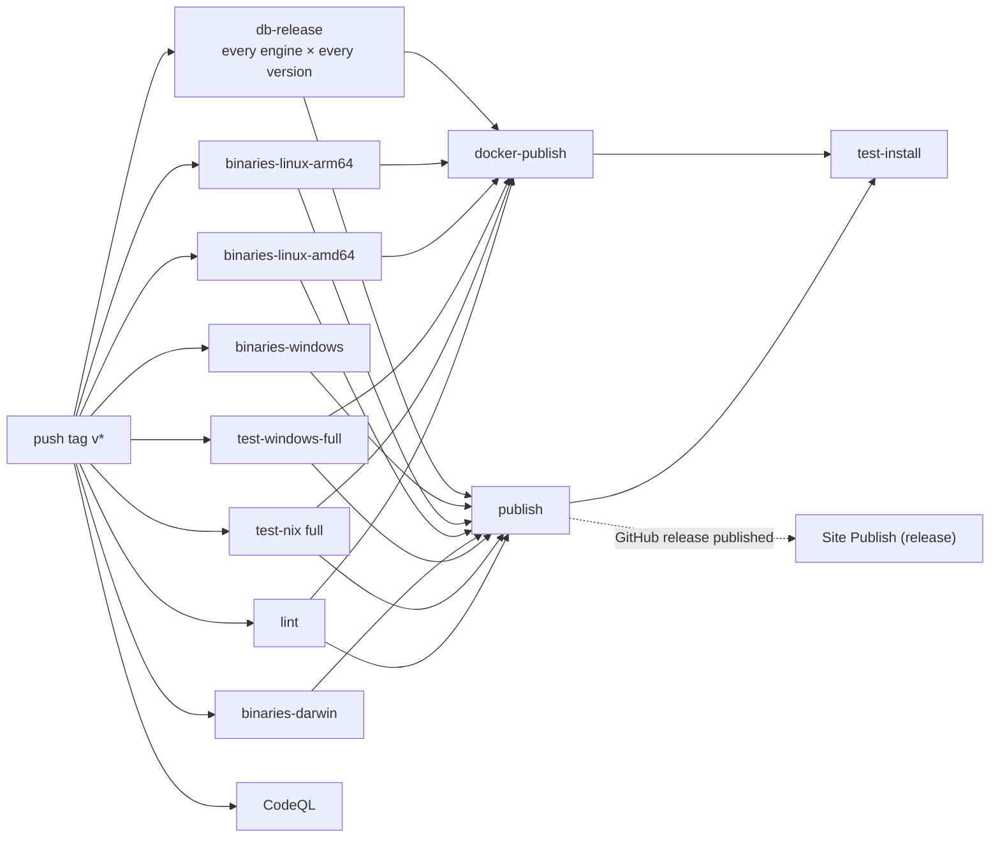
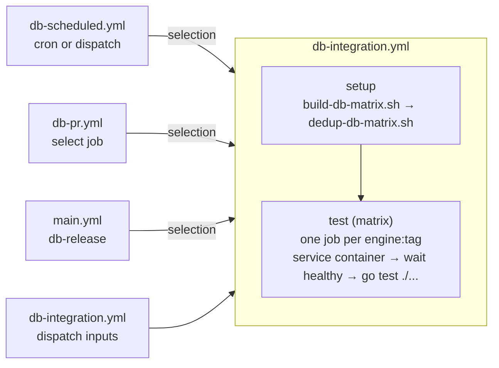

# CI

How sq's continuous integration works, for two readers: contributors who want to know what
runs on their pull request and what a release does, and maintainers who need to change it.
The local development loop (Makefile targets, hooks, the inner loop) is in
[`DEVELOPER.md`](./DEVELOPER.md); the release procedure is in [`RELEASING.md`](./RELEASING.md).

## The 30-second version

- A pull request gets a fast loop: lint, the Go suite with `-short` on Linux and macOS, a
  Windows smoke suite, a formatting gate, and a dependency review. Four to five minutes.
- Touch a database driver and the PR also runs that engine's integration legs, against the
  newest and oldest supported versions.
- Every night the full suite runs against every SQL engine at both version bookends; every
  week against every supported version.
- A `v*` tag runs everything, including every engine at every version, and only then publishes
  and smoke-tests the installers.

## Workflow inventory

All workflows live in [`.github/workflows/`](../.github/workflows).

| Workflow                   | File                        | Trigger                                                     | Purpose                                                              | Gates                         |
| -------------------------- | --------------------------- | ----------------------------------------------------------- | -------------------------------------------------------------------- | ----------------------------- |
| Main Pipeline              | `main.yml`                  | PR, push `master`, tag `v*`, nightly 09:17 UTC, dispatch    | Build, test, lint; on tags build, publish and canary the release     | `publish`, `docker-publish`   |
| Format                     | `format.yml`                | push `master`/`develop` or PR touching formatted file types | `dprint check` and Biome                                             | nothing (advisory)            |
| Dependency Review          | `dependency-review.yml`     | PR, ignoring `**.md`, `sq.json` and `.github/**`            | Flags risky dependency changes                                       | nothing (advisory)            |
| DB integration             | `db-integration.yml`        | `workflow_call`, dispatch                                   | One job per engine:version, `go test ./...` against a live container | callers decide                |
| DB integration (scheduled) | `db-scheduled.yml`          | nightly 04:00 UTC, Mon 05:00 UTC, dispatch                  | Every engine at bookends nightly, every version weekly               | nothing                       |
| DB integration (PR)        | `db-pr.yml`                 | PR touching `drivers/**` or the DB machinery                | That engine's bookends, or every engine's for machinery changes      | nothing (advisory)            |
| Coverage                   | `coverage.yml`              | nightly 09:37 UTC, dispatch                                 | Full suite with coverage, uploaded to Codecov                        | nothing                       |
| CodeQL                     | `codeql.yml`                | tag `v*`, nightly 10:36 UTC, dispatch                       | Go security analysis                                                 | nothing                       |
| CodeQL site                | `codeql-site.yml`           | push/PR on `site/**`, Fri 11:00 UTC                         | JavaScript security analysis for the site                            | nothing                       |
| Test Install               | `test-install.yml`          | `workflow_call`, dispatch                                   | Installs the published release on nine platforms                     | nothing (post-publish canary) |
| Site CI                    | `site-ci.yml`               | push/PR on `site/**`                                        | Lint and build the site (`make ci`)                                  | nothing                       |
| Site Publish (dispatch)    | `site-publish-dispatch.yml` | dispatch, type `DEPLOY`                                     | Manual production publish                                            | n/a                           |
| Site Publish (release)     | `site-publish-release.yml`  | stable release published                                    | Auto-publish sq.io                                                   | n/a                           |
| Site Publish to Netlify    | `site-publish-netlify.yml`  | `workflow_call`                                             | Shared build, upload, post-deploy smoke                              | n/a                           |
| Site data (nightly)        | `site-data-nightly.yml`     | daily 07:00 UTC, dispatch                                   | Refresh `site/data/github.toml`                                      | n/a                           |
| Site Links (nightly)       | `site-links-nightly.yml`    | daily 07:15 UTC, dispatch                                   | External link crawl                                                  | n/a                           |

"Gates" means a `needs:` edge that stops a later job. Master has no required status checks (see
[What gates what](#what-gates-what)), so on a PR every workflow is advisory in the strict sense;
"gates" in this table is about the release path.

## What runs when

### On a pull request

Main Pipeline skips PRs that touch only `**.md`, `sq.json` or `site/**`: a docs edit does not
need a Go build, and `sq.json` is the Scoop manifest, which the release itself updates. Those
PRs are not unchecked, though. Format runs on every Markdown, Go, JSON, YAML, TOML, SCSS, CSS
and JS change, precisely so that doc-only and site-only changes still meet a formatting gate, and
`site/**` changes get Site CI and CodeQL site. Dependency Review ignores `.github/**` as well,
so a workflow-only PR skips it.

Pushing again to the same PR cancels the in-flight Main Pipeline run: its `concurrency` group is
keyed on workflow, event and ref, with `cancel-in-progress` evaluated to true for anything that
is neither `master` nor a `v*` tag. Master merges and release tags therefore always run to
completion. `db-pr.yml` cancels superseded runs too, unconditionally, since it only ever runs on
a pull request.

`db-pr.yml` computes its selection from the PR's changed files (see
[DB integration](#db-integration)) rather than from a hand-maintained path list: the engine names
come from the keys of `.github/sakila-db.json`, which are the `drivers/<engine>/` directory
names. A PR touching only an embedded driver such as `drivers/duckdb/` matches the `drivers/**`
trigger, selects no external engine, and then skips the run job, which is why an embedded-only
change shows the workflow as green with nothing under it.

### On merge to master

Main Pipeline runs the same fast loop it runs on a PR (lint, `test-nix` with `-short` on Linux
and macOS, `test-windows-smoke`), but without cancel-on-push: every commit that lands on master
is tested to completion.

Format, Site CI and CodeQL site run if their paths changed. Nothing else runs on a master merge:
no DB integration, no coverage, no CodeQL for Go. Master relies on the nightly schedule for
everything expensive, which is a deliberate trade of "known good within a day" for a merge queue
that stays minutes rather than tens of minutes long.

### Nightly and weekly

All times UTC.

| Time         | Workflow                   | What                                               |
| ------------ | -------------------------- | -------------------------------------------------- |
| 04:00 daily  | DB integration (scheduled) | every engine at bookends, `go test ./...`          |
| 05:00 Monday | DB integration (scheduled) | every engine at every supported version            |
| 07:00 daily  | Site data (nightly)        | refresh `site/data/github.toml`, commit if changed |
| 07:15 daily  | Site Links (nightly)       | lychee external link crawl                         |
| 09:17 daily  | Main Pipeline              | full suite (no `-short`) on Linux, macOS, Windows  |
| 09:37 daily  | Coverage                   | full suite with coverage to Codecov                |
| 10:36 daily  | CodeQL                     | Go analysis                                        |
| 11:00 Friday | CodeQL site                | JavaScript analysis                                |

The Monday 05:00 run is the same workflow as the 04:00 nightly; `db-scheduled.yml` distinguishes
them by matching `github.event.schedule` against the weekly cron string, because
`github.event.inputs.mode` is empty on a cron trigger.

### On a release tag

`publish` cuts the GitHub release with GoReleaser and pushes to every channel: archives and
checksums, the Homebrew tap, the Scoop bucket, the nfpm packages, Gemfury and the AUR (see
[Release](#release)).

`docker-publish` is a sibling of `publish`, not downstream of it, so the image ships with the
release rather than being withheld by an unrelated install-test failure. It shares most of
`publish`'s gates, minus the darwin and windows binary builds, which it does not consume.

`test-install` runs after both and gates nothing: by then every channel is live, so a failure
means users are already affected. Treat a red `test-install` as an incident to fix forward, not
as a release that can be held back.

The site auto-publishes on the `release: published` event, but only for stable releases: the job
in `site-publish-release.yml` requires a `v`-prefixed tag name and rejects prereleases and
drafts. CodeQL for Go also runs on the tag, as part of release validation.

### Manual dispatch

| Workflow                       | Inputs                                                       | Use it to                                                                              |
| ------------------------------ | ------------------------------------------------------------ | -------------------------------------------------------------------------------------- |
| Main Pipeline                  | none                                                         | run the full suite against a branch                                                    |
| DB integration (scheduled)     | `mode: bookends \| all`                                      | every engine, at bookends or every version                                             |
| DB integration                 | one input per engine, comma-separated selectors; blank skips | specific engines and versions, e.g. `postgres=all`, or `postgres=10 mysql=8 rqlite=10` |
| Coverage, CodeQL, Test Install | none                                                         | on demand                                                                              |
| Site Publish (dispatch)        | `confirm: DEPLOY`, optional message                          | publish sq.io from a branch or tag before a release                                    |
| Site data, Site Links          | none                                                         | on demand                                                                              |

Dispatch from the Actions tab or `gh workflow run <file> --ref <branch> -f key=value`. Note that
every job in `test-install.yml` carries `if: startsWith(github.ref, 'refs/tags/v')`, so dispatch
it against a release tag; against a branch it starts and skips every job.

## Main Pipeline

[`main.yml`](../.github/workflows/main.yml) is the core Go workflow.

- `test-nix`: `go build` then `go test` on `ubuntu-24.04` and `macos-15`. `FULL_RUN` is true on
  schedule, on `v*` tags and on dispatch; otherwise the run passes `-short`, which skips tests
  marked with `tu.SkipShort` (large-fixture ingest and everything that needs a container).
  Output goes through `tparse` for a sorted summary.
- `test-windows-smoke`: PRs and master merges only. Builds everything (catching CGO/SQLite
  breakage) and runs `./test/smoke/...`. Compiling everything is half the point: it catches
  CGO/SQLite breakage cheaply, while the focused smoke suite keeps the dev loop fast.
- `test-windows-full`: the full Windows suite on schedule, tags and dispatch. It gates
  `publish`.
- `lint`: actionlint over the workflow files, shellcheck over `install.sh`,
  `scripts/fmt-go-imports.sh` and the four DB-matrix scripts, the two hermetic DB-matrix test
  scripts, the Go import-grouping check (`scripts/fmt-go-imports.sh`, changed files only on a
  PR, the whole module otherwise), and golangci-lint. Import grouping is enforced here because
  build, vet and golangci-lint do not catch it; run `make fmt` before pushing.
- `binaries-*`: four per-platform GoReleaser builds on `v*` tags, each with its own config
  (`.goreleaser-darwin.yml`, `-linux-amd64`, `-linux-arm64`, `-windows`), uploaded as
  artifacts.
- `db-release`, `publish`, `docker-publish`, `test-install`: see [Release](#release).

Pinned tool versions live in the `env:` block at the top of the file (`GORELEASER_VERSION`,
`GOLANGCI_LINT_VERSION`, `TPARSE_VERSION`) and `BUILD_TAGS` is the SQLite feature set every job
builds with.

## DB integration

SQL drivers are tested against real databases from the
[`sakiladb`](https://github.com/sakiladb) images. The design is recorded in #1133.

### Topology: one engine per job

Every job starts exactly one engine as a service container and runs `go test ./...` against
it. SQLite and DuckDB are embedded, so every job also has two live embedded sources, which is
how cross-source coverage works: each leg runs {embedded} × {engine} in both directions
(`sakila.CrossSourceDests`). No job ever runs two server engines at once; the tests that used
to need that were rewritten onto embedded handles (#964, #1143).

Why not all engines in one job: a single leg already deletes about 20 GB of preinstalled
toolchains to avoid running out of disk, one runner cannot host six servers plus a parallel
`go test ./...`, and a shared job loses the ability to name which engine failed. The price is
that the engine-independent part of the suite runs once per leg, which on the runs measured so
far works out at roughly 4x the aggregate compute of one shared job. Wall clock, not aggregate
compute, is what anyone waits on.

### `sakila-db.json` is the source of truth

[`.github/sakila-db.json`](../.github/sakila-db.json) maps each engine to its port, the
`SQ_TEST_SRC__*` envar the test harness reads, the DSN, and the supported `tags`, newest
first. The engine keys are exactly the `drivers/<engine>/` directory names; `db-pr.yml`
depends on that. `latest` is a floating tag and is never listed. The hermetic test
`scripts/build-db-matrix_test.sh` fails if `tags` is not newest-first.

To add a version: add the tag to `tags` in the right position. To add an engine: add an entry,
publish a `sakiladb/<engine>` image with a `HEALTHCHECK`, and name the driver directory
`drivers/<engine>/`. The scheduled, PR and release paths pick the new engine up automatically
through the `*` expansion; to be able to dispatch it on its own, also add a matching per-engine
`workflow_dispatch` input (and its `INPUT_*` wiring in the `setup` step) to
`db-integration.yml`.

### The selection grammar

A selection is `{engine: [selector, ...]}`. Selectors:

| Selector                              | Resolves to                                |
| ------------------------------------- | ------------------------------------------ |
| an explicit tag (`18`, `5.7`, `2019`) | that tag, even if not yet listed in `tags` |
| `latest`                              | the floating `:latest` image               |
| `oldest`                              | the last entry in `tags`                   |
| `bookends`                            | `latest` + `oldest`                        |
| `all`                                 | every entry in `tags`                      |

The engine key `*` means every engine; explicit keys alongside it append to that engine, so
`{"*":["latest"],"postgres":["9"]}` gives postgres `["latest","9"]` and every other engine
`["latest"]`. Any other word fails the `setup` job with
`unknown selector "<word>" for engine <engine>`. Resolution is in
[`scripts/build-db-matrix.sh`](../scripts/build-db-matrix.sh), which also drops exact-string
duplicate tags (first occurrence wins); then
[`scripts/dedup-db-matrix.sh`](../scripts/dedup-db-matrix.sh) drops entries whose image digest
matches an earlier one, which is why `bookends` on a single-tag engine is one leg, not two.
Dedup is best-effort: if a digest cannot be resolved the entry is kept.

### Scenarios

| Scenario     | Trigger                                        | Selection                   | Legs           |
| ------------ | ---------------------------------------------- | --------------------------- | -------------- |
| Nightly      | 04:00 UTC                                      | `{"*":["bookends"]}`        | 9              |
| Weekly       | Monday 05:00 UTC                               | `{"*":["all"]}`             | 19             |
| Release      | tag `v*`, gates `publish`                      | `{"*":["all"]}`             | 19             |
| Driver PR    | paths `drivers/<engine>/**`                    | `{"<engine>":["bookends"]}` | 1-2 per engine |
| Machinery PR | DB workflows, matrix scripts, `sakila-db.json` | `{"*":["bookends"]}`        | 9              |
| Ad hoc       | dispatch                                       | as given                    |                |

Nine bookend legs, not twelve, because clickhouse, oracle and rqlite have one tag each. Legs run
in parallel with `fail-fast` off, so the wall clock of a nine-leg or nineteen-leg run is the
slowest leg plus queueing: about 6 to 8 minutes per leg in practice, most of it setup rather
than tests. The disk cleanup alone costs 55 to 108 seconds, and the largest images (Oracle, SQL
Server) add a multi-minute pull before the first test runs.

### The `test` job, step by step

After checkout and Go setup:

1. `Free disk space`: removes preinstalled toolchains (Android, CodeQL, .NET, GHC, Swift) to
   reclaim inodes and about 20 GB. 55 to 108 seconds on average.
2. `Wait for DB healthy`: polls the service container's Docker healthcheck for up to five
   minutes (60 attempts, 5 seconds apart). Every `sakiladb` image declares one; an image without
   a `HEALTHCHECK` is not waited on. On timeout the step prints the last 100 lines of
   `docker logs` and fails.
3. `Build`, then `Integration tests`: exports the engine's `SQ_TEST_SRC__*` envar from the DSN
   in `sakila-db.json` (looked up at runtime so the credential never travels through job
   outputs, where GitHub's secret masking would drop it) and runs
   `go test -timeout 25m ./...`. Every other engine's envar is unset, so their tests skip via
   `testh.Helper.Source`. The embedded sources need no envar, so the whole SQLite and DuckDB
   suite runs in every leg.

## Release

The procedure (CHANGELOG, tag, push) is in [`RELEASING.md`](./RELEASING.md). This is what the
tag triggers.

### Why six GoReleaser configs

Each platform builds on its own runner (`macos-15` for darwin, `windows-2022` for windows,
`ubuntu-24.04` for linux, with a cross-compiler installed for arm64), using a per-platform
config that does nothing but build the CGO binary with sq's SQLite tags and emit it as a bare
`binary` archive. `publish` downloads all four artifact sets and runs `.goreleaser.yml`, whose
`builder: prebuilt` picks those binaries up rather than rebuilding them, then produces the
archives, checksums, packages and channel pushes. `docker-publish` runs
`.goreleaser-docker.yml` against the two linux artifact sets. GoReleaser Pro is used
(`GORELEASER_KEY`). `make goreleaser-verify-config` validates the umbrella config and the four
per-platform configs locally (not the docker config).

GoReleaser's own changelog generation is disabled (`changelog: disable: true`);
[`CHANGELOG.md`](../CHANGELOG.md) is written by hand before the tag, per
[`RELEASING.md`](./RELEASING.md). The release itself is `draft: false`, `prerelease: auto`, so a
tag such as `v0.50.0-rc.1` publishes as a prerelease and does not trigger the site publish.

### Channels

| Channel                                                                    | Config                       | Job              | Secret            |
| -------------------------------------------------------------------------- | ---------------------------- | ---------------- | ----------------- |
| GitHub release with archives and checksums                                 | `.goreleaser.yml` `release:` | `publish`        | `GH_PAT`          |
| Homebrew tap (`neilotoole/homebrew-sq`)                                    | `.goreleaser.yml` `brews:`   | `publish`        | `GH_PAT`          |
| Scoop bucket (`neilotoole/sq`)                                             | `.goreleaser.yml` `scoops:`  | `publish`        | `GH_PAT`          |
| apk, deb, rpm, termux.deb, archlinux packages                              | `.goreleaser.yml` `nfpms:`   | `publish`        |                   |
| Gemfury (deb and rpm)                                                      | `.goreleaser.yml` `furies:`  | `publish`        | `FURY_TOKEN`      |
| AUR (`sq-bin`)                                                             | `.goreleaser.yml` `aurs:`    | `publish`        | `AUR_PRIVATE_KEY` |
| `ghcr.io/neilotoole/sq` (amd64, arm64, multi-arch manifest, cosign-signed) | `.goreleaser-docker.yml`     | `docker-publish` | `GITHUB_TOKEN`    |

The Docker job pushes per-arch tags (`:<tag>-amd64`, `:<tag>-arm64`), stitches them into the
`:<tag>` and `:latest` manifests, and signs the manifests with keyless cosign, which is why it
needs `id-token: write`.

### `test-install`, the post-publish canary

[`test-install.yml`](../.github/workflows/test-install.yml) installs the just-published release
on nine platforms (Docker image, macOS Homebrew, `install.sh` on Linux, Alpine, Arch via pacman
and via yay, Homebrew on Ubuntu, Void Linux, Windows Scoop) and checks `sq version` reports the
tag. The `install.sh` job is itself a three-container matrix (Ubuntu, Fedora, Rocky 9), so the
nine jobs expand to eleven legs. Void Linux is the one exception to the version check: its
package is updated by hand, so that leg only asserts that `sq` runs. The Scoop job retries for
up to 20 minutes, because the bucket manifest is bumped by `publish` in the same pipeline.

It runs after `publish` and `docker-publish` and gates nothing. A failure here is a live
incident, not a blocked release.

## Quality, security, supply chain

- **Format** (`format.yml`): `dprint check` (Markdown, Go via gofumpt, JSON, YAML, TOML, SCSS,
  CSS, site JS) plus `biome lint` for site JS, on push to `master`/`develop` and on PR whenever
  a formatted file type changes. The `pre-commit` hook activated by `make init` runs
  `dprint check` on staged files, so this workflow is the backstop.
- **CodeQL** (`codeql.yml`, `codeql-site.yml`): scheduled Go and JavaScript analysis; the Go run
  also fires on release tags. Results land in the repository's Security tab.
- **Dependency Review** (`dependency-review.yml`): flags vulnerable or license-problematic
  dependency changes on PRs. One advisory is allow-listed (`GHSA-q7pp-wcgr-pffx`).
- **Dependabot** (`.github/dependabot.yml`): weekly for Go modules, root Bun packages, `site/`
  Bun packages, and GitHub Actions pins. Triage with the maintainer skills under
  [`.agents/skills/`](../.agents/skills) (`sq-gomod-dependabot`, `sq-site-dependabot`,
  `sq-actions-dependabot`).
- **Coverage** (`coverage.yml`): nightly full suite with `-coverpkg=./...` uploaded to Codecov
  (`CODECOV_TOKEN`). Not on PRs, and never a gate: the Codecov checks are informational.

## Site CI

The sq.io site under `site/` has its own build (Hugo, Bun) and its own workflows. Site CI lints
and builds on `site/**` changes and never deploys. Production deploys go through GitHub
Actions and the Netlify CLI only; Netlify's own git integration is disabled. Manual publish is
`site-publish-dispatch.yml` (type `DEPLOY`); a stable release auto-publishes via
`site-publish-release.yml`; both call `site-publish-netlify.yml`, which needs
`NETLIFY_AUTH_TOKEN` and `NETLIFY_SITE_ID`. The nightly data refresh pushes to master with
`SITE_DATA_PUSH_TOKEN`. See [`site/README.md`](../site/README.md) and
[`site/CLAUDE.md`](../site/CLAUDE.md).

## Maintainer guide

### Changing a workflow

- `lint` runs actionlint over every workflow file on every PR. Install it locally
  (`brew install actionlint`) to get the same check before pushing.
- dprint formats YAML. Run `bunx dprint fmt .github/workflows/<file>` before committing;
  the `pre-commit` hook will otherwise reject it.
- Third-party actions are pinned to a commit SHA with a version comment; GitHub-owned actions
  (`actions/*`, `github/codeql-action`) are pinned to a release tag. Dependabot bumps both. Keep
  new actions pinned the same way.
- A change to `db-*.yml`, the matrix scripts or `sakila-db.json` triggers `db-pr.yml` with
  every engine at bookends, so the PR that changes the machinery is its own smoke test.
- Test a change from a branch with `gh workflow run <file> --ref <branch>`; every dispatchable
  workflow accepts a ref.

### Reusable-workflow gotchas, learned the hard way

- In a `workflow_call` workflow, `inputs.<name>` is empty when the same file is run via
  `workflow_dispatch`; read `github.event.inputs.<name>` as a fallback (`db-integration.yml`
  does `inputs.x || github.event.inputs.x`).
- A job output containing a value GitHub has masked as a secret is silently dropped. That is
  why the DSN is looked up at runtime in the `test` job and never passes through the matrix.
- `workflow_dispatch` inputs with a non-empty default cannot express "blank means skip"; the
  per-engine inputs default to `""` for that reason.
- `db-integration.yml`'s `setup` fails on an empty selection rather than skipping, so a caller
  that might select nothing (`db-pr.yml`) must guard the call with an `if`.
- A `uses:` job can carry `if:` and `needs:` but not `steps:`; put logic in a preceding job.
- `github.event.inputs.<name>` is empty on a cron trigger, so a workflow with two schedules
  tells them apart by matching `github.event.schedule` against the cron string, as
  `db-scheduled.yml` does for its weekly run.

### Secrets inventory

| Secret                                  | Used by                                                                   | For                                             |
| --------------------------------------- | ------------------------------------------------------------------------- | ----------------------------------------------- |
| `GH_PAT`                                | `binaries-*`, `publish`                                                   | GoReleaser: release, tap and bucket pushes      |
| `GORELEASER_KEY`                        | `binaries-*`, `publish`, `docker-publish`                                 | GoReleaser Pro                                  |
| `FURY_TOKEN`                            | `publish`                                                                 | Gemfury upload                                  |
| `AUR_PRIVATE_KEY`                       | `publish`                                                                 | AUR package push                                |
| `GITHUB_TOKEN` (built in)               | `docker-publish`; as `github.token` in `db-pr.yml` and the site workflows | ghcr.io login; PR file listing; site data fetch |
| `CODECOV_TOKEN`                         | `coverage`                                                                | Codecov upload                                  |
| `NETLIFY_AUTH_TOKEN`, `NETLIFY_SITE_ID` | `site-publish-netlify.yml`                                                | production deploy                               |
| `SITE_DATA_PUSH_TOKEN`                  | `site-data-nightly.yml`                                                   | push the data commit to master                  |

### Adding a release channel

Add the block to `.goreleaser.yml` (see the existing `brews:`, `scoops:`, `nfpms:`, `furies:`,
`aurs:` entries), add any secret to `publish`'s `env:` in `main.yml`, run
`make goreleaser-verify-config`, and add a `test-install.yml` job that installs from the new
channel and checks `sq version`.

## What gates what

Branch protection on `master` requires one approving review (stale reviews dismissed) and no
status checks. A PR with red checks is mergeable. The checks are a signal to the reviewer, not a
lock. Admin enforcement is off, so a maintainer can merge their own PR with
`gh pr merge --squash --admin`.

The real gates are `needs:` edges on the release path: `publish` and `docker-publish` will not
run unless `lint`, `test-nix`, `test-windows-full`, the `binaries-*` jobs and `db-release` all
succeed. `test-install` and the site publish are downstream of `publish` and gate nothing.

## Troubleshooting

- **`lint` fails on Go import grouping.** Run `make fmt` and commit. Build, vet and golangci-lint
  do not catch this; only the `fmt-go-imports.sh` step does.
- **`Format` or the pre-commit hook fails.** Run `bunx dprint fmt` on the file. Do not chase
  markdownlint; dprint is the gate.
- **A DB leg dies with "no space left on device".** The `Free disk space` step should prevent
  it; if it recurs, the runner image has grown and the `rm` list in `db-integration.yml` needs
  another directory.
- **One DB leg is red and the rest are green.** Rerun that leg alone:
  `gh run rerun <run-id> --failed`. `fail-fast` is off, so the others are not affected.
- **`Wait for DB healthy` times out.** `docker logs` for the container are printed in the step.
  Oracle can legitimately take over a minute; the wait allows five.
- **Image pull is rate-limited.** Images are pulled from `ghcr.io/sakiladb`, which has no
  anonymous rate limit, precisely to avoid this. If a leg is pulling from Docker Hub, the
  `SAKILADB_REGISTRY` env in `db-integration.yml` has been changed.
- **`setup` says `unknown selector`.** A dispatch input has a typo. Valid selectors are listed
  under [The selection grammar](#the-selection-grammar).
