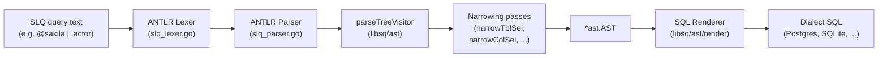
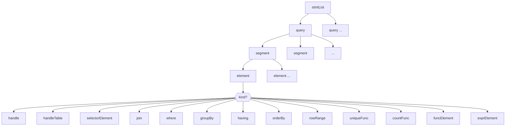
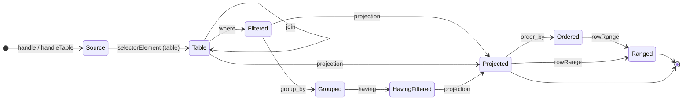
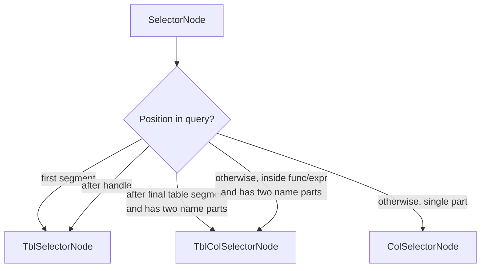
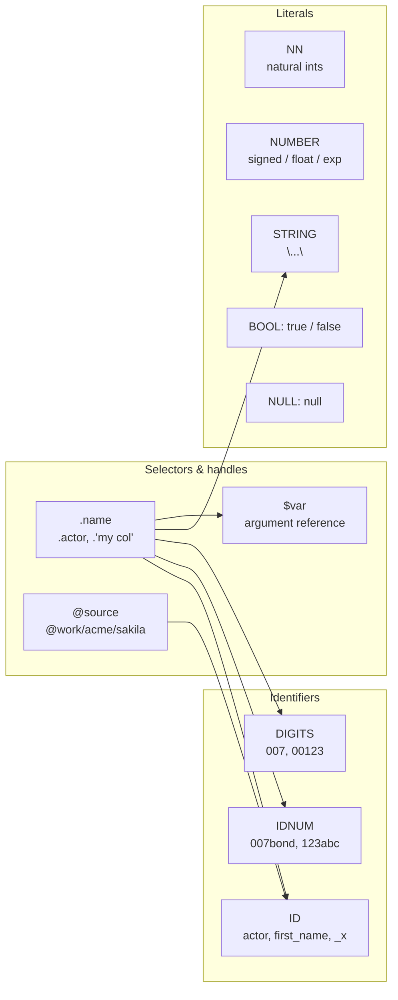

# SLQ Grammar

The query language used by [`sq`](https://sq.io) is formally known as **SLQ**.
This directory contains the formal grammar (`SLQ.g4`, written in
[ANTLR4](https://www.antlr.org/) syntax) and the tooling that turns it into a
Go parser. This README is the high-level companion to [`SLQ.g4`](./SLQ.g4):
read this first, then dive into the grammar file for the rule-by-rule detail.

The grammar is **not yet stable**: it may change in any new `sq` release.

## Contents

- [SLQ at a glance](#slq-at-a-glance)
- [How SLQ becomes SQL](#how-slq-becomes-sql)
- [Query structure](#query-structure)
- [Element catalog](#element-catalog)
- [Lexical layer](#lexical-layer)
- [Operator precedence](#operator-precedence)
- [Working with the grammar](#working-with-the-grammar)
- [Common pitfalls](#common-pitfalls)
- [Further reading](#further-reading)

## SLQ at a glance

SLQ is a pipeline language. A query is a chain of *segments* separated by `|`,
each transforming the previous one — the same mental model as Unix pipelines
or `jq`. The renderer maps each segment to (part of) a SQL clause.

```text
@sakila | .actor | .first_name, .last_name | .[0:10]
└──────┘   └────┘   └─────────────────────┘   └────┘
 source     table     projection              row range

≈   SELECT "first_name", "last_name"
    FROM   "actor"
    LIMIT  10 OFFSET 0
```

Three things to internalize before reading the grammar:

1. **Segments are pipes.** `|` separates segments; `,` separates elements
   *inside* a segment.
2. **Selectors are dotted.** `.actor`, `.first_name`, `.actor.first_name` —
   the leading dot is part of the token.
3. **Handles are sources.** `@sakila` (or `@work/acme/sakila`) names a
   registered data source. `@sakila.actor` is shorthand for
   `@sakila | .actor`.

## How SLQ becomes SQL

The path from query text to executed SQL spans three packages. The generated
parser lives in `libsq/ast/internal/slq`, the AST lives in `libsq/ast`, and
the dialect-specific renderer lives in `libsq/ast/render`.



| Stage | Input | Output | Where it lives |
| --- | --- | --- | --- |
| Lex | text | token stream | `slq.SLQLexer` (generated) |
| Parse | tokens | parse tree | `slq.SLQParser` (generated) |
| Build | parse tree | initial AST | `parseTreeVisitor` (`libsq/ast`) |
| Narrow | initial AST | typed AST | `narrow*` passes (see `process.go`) |
| Verify | typed AST | typed AST | `verify` |
| Render | typed AST | SQL string | `libsq/ast/render` (per-dialect) |

The grammar is the *contract* between lex/parse and everything downstream.
Changing it is a downstream-ripple operation: the parser must be regenerated
**and** the AST builder usually needs adjusting to match.

### Public entry points

- [`libsq/ast.Parse(log, input)`](../libsq/ast/parser.go) — turn SLQ text
  into an `*ast.AST`. This is what consumers of the language should call.
- [`libsq.ExecSLQ`](../libsq/libsq.go) — the top-level "run a query"
  entry. It calls `ast.Parse` internally.

The generated Go sources land in `libsq/ast/internal/slq/` and **must not be
hand-edited** — they will be overwritten the next time the grammar is
regenerated.

## Query structure

The parser's view of a query is a small tree:



Concretely: a `stmtList` is one or more `query`s separated by `;`. A `query`
is one or more `segment`s separated by `|`. A `segment` is one or more
`element`s separated by `,`. An `element` is one of the thirteen kinds in
the diagram above. The thirteen-way fan-out is where the grammar's
expressive power lives.

### Where each element legally appears

Most elements can appear in any segment, but a few have positional rules
that the AST builder enforces:



A few enforced rules:

- **`having` requires `group_by`** — checked by AST verification, not the
  grammar.
- **At most one `rowRange`** per query (`verifyRowRange`).
- The first segment's selector is interpreted as a table selector, not a
  column selector (`narrowTblSel`).

## Element catalog

Quick reference for every element kind. See [`SLQ.g4`](./SLQ.g4) for the
exact grammar and the sample queries in `testdata/` for live examples.

**`handle`** — `@sakila`. Names a registered data source. Aliasing is not
allowed at the handle level.

**`handleTable`** — `@sakila.actor`. Source + table in one element.
Shorthand for `@sakila | .actor`.

**`selectorElement`** — `.first_name:given_name`. A dotted selector with
optional alias. Role (table vs. column vs. table-column) is decided by
position via the narrowing passes.

**`join`** — `join(.film, .actor.id == .film.id)`. Maps to `JOIN ... ON
...`. Thirteen kinds including `cross_join`; `NATURAL JOIN` is excluded
by design.

**`where`** — `where(.id > 10)`. Maps to `WHERE`. Also spelled
`select(...)` (the `jq` form); the two are equivalent at the parser
level.

**`groupBy`** — `group_by(.customer_id)`. Maps to `GROUP BY`. Aliases:
`group_by`, `gb`.

**`having`** — `having(sum(.amount) > 100)`. Maps to `HAVING`. Must follow
a `group_by` (enforced at AST verification, not parse).

**`orderBy`** — `order_by(.last_name-)`. Maps to `ORDER BY ... ASC/DESC`;
`+` / `-` suffix per term selects direction. Aliases: `order_by`,
`sort_by`, `ob`.

**`rowRange`** — `.[10:15]`. Maps to `LIMIT` / `OFFSET`. `jq`-style slice
syntax; see [Row ranges](#row-ranges).

**`uniqueFunc`** — `unique`. Maps to `DISTINCT`. Bare keyword, no parens.
Alias: `uniq`.

**`countFunc`** — `count`, `count(*)`, `count(.id):n`. Maps to
`COUNT(...)`. Special-cased because of the bare form (no parens).

**`funcElement`** — `sum(.amount):total`. Generic `<fn>(...) AS <alias>`.
For portable functions listed in `funcName` and proprietary `_fn` calls.

**`exprElement`** — `(1+2):total`. Arbitrary expression as a result
column with an optional alias.

### Selector resolution

A `selector` in the grammar is just `.name` or `.name1.name2`. Whether it
refers to a table, a column, or a `table.column` pair is decided after
parsing by the *narrowing* passes:



This two-step approach — keep the grammar deliberately ambiguous, then
disambiguate using context — keeps the grammar small. The trade-off is
that some "obvious" errors are caught at AST-build time, not parse time.

### Row ranges

`jq`-style slice forms map to SQL `LIMIT`/`OFFSET` as follows:

| SLQ | Meaning | SQL |
| --- | --- | --- |
| `.[]` | all rows | *(no LIMIT/OFFSET)* |
| `.[10]` | row index 10 | `LIMIT 1 OFFSET 10` |
| `.[10:15]` | rows 10–15 | `LIMIT 5 OFFSET 10` |
| `.[0:15]` / `.[:15]` | first 15 rows | `LIMIT 15 OFFSET 0` |
| `.[10:]` | from row 10 onwards | `OFFSET 10` |

The grammar admits all five forms in a single rule; the conversion to
`{offset, limit}` happens in [`VisitRowRange`](../libsq/ast/range.go).

## Lexical layer

A few tokens deserve special attention because they cross-cut the grammar.



### Identifier rules and the issue-470 trio

For numeric-prefixed schema/catalog names (issue #470), the lexer
distinguishes three identifier-like token families:

- **`ID`** — `[a-zA-Z_][a-zA-Z0-9_]*`. The classic identifier; cannot start
  with a digit.
- **`IDNUM`** — `[0-9]+[a-zA-Z_][a-zA-Z0-9_]*`. Digits followed by at least
  one letter or underscore. Matches `007bond`.
- **`DIGITS`** — `[0-9]+`. Pure digit runs, including leading zeros.
  Matches `007`.

These all feed into `NAME`. The interaction with `NN` (natural number,
no leading zeros) is subtle:

- For `42`, the lexer must choose `NN` over `DIGITS` so that numeric
  literals don't become identifiers. **Definition order** breaks the tie:
  `NN` is defined before `DIGITS`.
- For `007bond`, ANTLR's **maximal munch** rule prefers `IDNUM` (the
  longest match) over `DIGITS` followed by stray `bond`.

If you reorder these lexer rules, expect numeric-literal regressions.

### The `ALIAS_RESERVED` hack

`alias` allows `:` + identifier/string. But what if the alias *text* is a
SLQ keyword? For example:

```text
.actor | count:count
```

The bare `count` after the colon would be lexed as the `count` keyword,
not as an alias name, and parsing fails. `ALIAS_RESERVED` is the
workaround: for each problematic keyword, the literal `:keyword` is
pre-baked as a single token. The AST builder then strips the leading
colon (see [`alias.go`](../libsq/ast/alias.go)). The list is small
(`:count`, `:avg`, `:min`, `:max`, `:group_by`, `:order_by`, `:unique`,
`:count_unique`) and needs to be kept in sync as new keywords are added.

This is acknowledged as a wart and could likely be refactored away with
a redesigned `alias` rule.

### Comments and whitespace

- Whitespace (`\t`, `\r`, `\n`, space) is skipped.
- `#` starts a comment that runs to end of line; also skipped.

## Operator precedence

`expr` is a left-recursive rule. ANTLR resolves precedence by alternative
order — earlier alternatives bind tighter. The full ladder, tight → loose:

```text
        (expr)                     -- parens (tightest)
        selector / literal / arg
        unary  -x  +x  ~x  !x
        ||                          -- SQL string concat (NOT logical-or)
        *  /  %
        +  -
        <<  >>  &                   -- bitwise
        <  <=  >  >=
        ==  !=
        &&                          -- logical-and (loosest)
        func(...)                   -- function call
```

**Watch out:** in SLQ, `||` means SQL string concatenation (as in SQLite
and Postgres), **not** logical-or. Boolean disjunction is currently not a
first-class operator; users typically rewrite with multiple `where`
clauses or use database-specific tricks via `_proprietary` functions.

## Working with the grammar

### Regenerating the parser

Regeneration runs the bundled `antlr4` JAR (under `tools/`) and writes Go
sources to `libsq/ast/internal/slq/`:

```shell
# either:
go generate ./...

# or, directly:
cd grammar && ./generate.sh
```

You need Java to be available, because `antlr4` is Java-based. The exact
JAR is committed in `tools/antlr-4.13.0-complete.jar`, so no separate
ANTLR install is required.

The generated files MUST NOT be hand-edited — they are wholly derived
from `SLQ.g4` and will be overwritten on the next regeneration.

### Recommended local tooling

For grammar authoring you'll want:

- The [antlr4 tools](https://github.com/antlr/antlr4-tools) for testing
  grammars from the command line:

  ```shell
  pip install antlr4-tools
  ```

- Optionally, [antlr4ts](https://github.com/tunnelvisionlabs/antlr4ts):

  ```shell
  npm install antlr4ts
  ```

- The
  [VS Code ANTLR4 extension](https://github.com/mike-lischke/vscode-antlr4)
  for in-editor diagnostics, railroad diagrams, and parse-tree previews.

### Sample inputs

`testdata/` contains a corpus of valid SLQ snippets. `all-valid.slq` is a
broad smoke test; the `*.test.slq` files exercise specific element kinds
(`join-*`, `range-*`, `column-alias`, `select-*`). When evolving the
grammar, extend these alongside your changes.

### Editing checklist

Before sending a grammar change:

1. Update [`SLQ.g4`](./SLQ.g4) — keep comments adjacent to the rules they
   describe.
2. Regenerate: `go generate ./...`.
3. Build: `go build ./libsq/ast/internal/slq` (the `generate.sh` script
   does this automatically as a sanity check).
4. Update [`libsq/ast`](../libsq/ast) visitors / narrowing passes if you
   touched any rule that produces a new shape of parse tree.
5. Add or extend sample inputs under `testdata/`.
6. Run `make test` (or `make test-short` to skip Docker-backed tests).

## Common pitfalls

A non-exhaustive list of things that have bitten contributors:

- **Element-order ambiguity.** `handleTable` must come before `handle`
  in the `element` alternative list, or `@sakila.actor` would be parsed
  as `@sakila` followed by mystery input.
- **`NN` vs `DIGITS` order.** Reordering these lexer rules silently
  changes how integer literals tokenize.
- **`select` vs `where`.** Both spellings work for filtering. Don't
  confuse `select(...)` (a `WHERE`) with a SQL `SELECT` list — the
  projection in SLQ is just a comma-separated selector list.
- **`||` is concat, not OR.** See [Operator precedence](#operator-precedence).
- **Aliasing a keyword.** Always works via the `:keyword` form thanks to
  `ALIAS_RESERVED`, but only for the keywords listed there. New
  keywords need to be added.
- **Arg references aren't aliases.** `:$x` is grammatically accepted (the
  `alias` rule's `ARG` branch) but rejected at AST-build time — an argument
  reference is a value placeholder, not a name. Use a plain or quoted alias
  instead.
- **`narrowing` passes can reject grammatically-valid input.** Some
  errors only surface at AST-build time (e.g. `having` without
  `group_by`, multiple row ranges). Grep `libsq/ast` for `verify*` /
  `narrow*` if a query parses but fails downstream.

## Further reading

- [`SLQ.g4`](./SLQ.g4) — the grammar itself, extensively commented.
- [`libsq/ast`](../libsq/ast) — AST types, the parse-tree visitor, and
  narrowing/verification passes.
- [`libsq/ast/render`](../libsq/ast/render) — dialect-specific SQL
  rendering.
- [sq.io](https://sq.io) — end-user docs (query syntax, command
  reference).
- [ANTLR4 reference](https://github.com/antlr/antlr4/blob/master/doc/index.md)
  — definitive guide to the grammar metalanguage used in `SLQ.g4`.
- [`jq` manual](https://jqlang.github.io/jq/manual/) — SLQ's primary
  syntactic inspiration.
