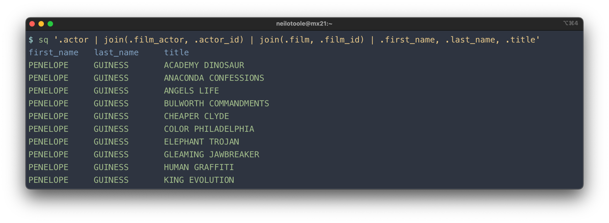

`sq` implements a [jq](https://jqlang.github.io/jq/)-style query language, formally
known as [`SLQ`](https://github.com/neilotoole/sq/tree/master/grammar).

Behind the scenes, all `sq` queries execute against a SQL database. This is true even for
[document sources](/docs/source#document-source) such as [CSV](/docs/drivers/csv)
or [XLSX](/docs/drivers/xlsx). For those document
sources, `sq` loads the source data into an [ingest database](/docs/source#ingest),
and executes the query against that database.


Because it's all SQL at the backend, you can always bypass `sq`'s query language
and execute database-native SQL queries using the [`sq sql`](/docs/cmd/sql) command.



The `sq` query command has many flags. See the [`sq`](/docs/cmd/sq) command reference
for details.


## Fundamentals

Let's take a look at a query that shows the main elements.

```shell
$ sq '@sakila_pg | .actor | where(.actor_id < 10) | .first_name, .last_name | .[0:3]'
first_name  last_name
PENELOPE    GUINESS
NICK        WAHLBERG
ED          CHASE
```

You can probably guess what's going on above. This query has 5 _segments_:

| Handle       | Table    | Filter                  | Column(s)                 | Row Range |
|--------------|----------|-------------------------|---------------------------|-----------|
| `@sakila_pg` | `.actor` | `where(.actor_id < 10)` | `.first_name, .last_name` | `.[0:3]`  |

Ultimately the SLQ query is translated to a SQL query, which is executed
against the `@sakila_pg` source (which in this example is a [Postgres](/docs/drivers/postgres)
database). The generated SQL query will look something like:

```sql
SELECT "first_name", "last_name" FROM "actor"
WHERE "actor_id" < 10
LIMIT 3 OFFSET 0
```

## Shorthand

For a single-table query, you can concatenate the handle and table name.
In this example, we list all the rows of the `actor` table.

```shell
# Longhand
$ sq '@sakila_pg | .actor'

# Shorthand
$ sq '@sakila_pg.actor'
```

If the query only has a single segment and doesn't contain any shell delimiters
or control chars, you can omit the quotes:

```shell
$ sq @sakila_pg.actor
```

If the query is against the [active source](/docs/cmd/src), then you don't even
need to specify the handle.

```shell
$ sq .actor
```


You can override the [active source](/docs/source#active-source)
for the current query using the [`--src`](/docs/source#source-override) flag, or override the source's
[catalog and/or schema](/docs/concepts#schema--catalog) using [`--src.schema`](/docs/source#source-override),
or even combine the two.

```shell
# Query @sakila_pg instead of the active source.
$ sq --src @sakila_pg '.actor'

# Query using the "public" schema of the active source's current catalog.
$ sq --src.schema public '.actor'

# Query using the "public" schema of the active source's "inventory" catalog.
$ sq --src.schema inventory.public '.products'

# Query using the "public" schema of @sakila_pg's "inventory" catalog.
$ sq --src @sakila_pg --src.schema inventory.public '.products'
```



## Filter results (`where`)

Use the `where()` mechanism to filter results.

```shell
$ sq '.actor | .first_name, .last_name | where(.first_name == "TOM")'
first_name  last_name
TOM         MCKELLEN
TOM         MIRANDA
```

Ultimately a filter is translated into a SQL `WHERE` clause such as:

```sql
SELECT "first_name", "last_name" FROM "actor" WHERE "first_name" = "TOM"
```


For interoperability with jq, you can use the
[`select()`](https://jqlang.github.io/jq/manual/v1.6/#select(boolean_expression))
synonym:

```shell
$ sq '.actor | select(.first_name == "TOM")'
```

For discussion of `where()` vs `select()`, see this [issue](https://github.com/neilotoole/sq/issues/254).


## Operators

The typical comparison operators are available in expressions:

```shell
$ sq '.actor | where(.actor_id < 3)'
actor_id  first_name  last_name  last_update
1         PENELOPE    GUINESS    2020-06-11T02:50:54Z
2         NICK        WAHLBERG   2020-06-11T02:50:54Z
```

| Operator | Description              |
|----------|--------------------------|
| `==`     | Equal to                 |
| `!=`     | Not equal to             |
| `<`      | Less than                |
| `<=`     | Less than or equal to    |
| `>`      | Greater than             |
| `>=`     | Greater than or equal to |

You can use boolean operators (`&&`, `||`) to combine expressions.

```shell
$ sq '.actor | where(.actor_id <= 2 || .actor_id == 105)'
actor_id  first_name  last_name  last_update
1         PENELOPE    GUINESS    2020-06-11T02:50:54Z
2         NICK        WAHLBERG   2020-06-11T02:50:54Z
105       SIDNEY      CROWE      2020-06-11T02:50:54Z
```

For boolean and boolean-like (`bit`, `int`) columns, you can compare using `true` and `false` literals.

```shell
$ sq '.people | where(.is_alive == false)'
name        is_alive
Kubla Khan  false

$ sq '.people | where(.is_alive == true)'
name         is_alive
Kaiser Soze  true
```

Use parentheses to group expressions.

```shell
$ sq '.actor | where(.actor_id <= 2 || (.actor_id > 100 && .first_name == "GROUCHO"))'
actor_id  first_name  last_name  last_update
1         PENELOPE    GUINESS    2020-06-11T02:50:54Z
2         NICK        WAHLBERG   2020-06-11T02:50:54Z
106       GROUCHO     DUNST      2020-06-11T02:50:54Z
172       GROUCHO     WILLIAMS   2020-06-11T02:50:54Z
```

## Grouping and sorting

These constructs shape the result set after filtering. Like
[`where`](#filter-results-where), each maps to a SQL clause: `group_by` and
`having` to `GROUP BY` / `HAVING`, `order_by` to `ORDER BY`, and `unique` to
`DISTINCT`.

### `group_by`

Use `group_by` to [group](https://en.wikipedia.org/wiki/Group_by_(SQL)) results.

```shell
$ sq '.payment | .customer_id, sum(.amount) | group_by(.customer_id)'
```

This translates into:

```sql
SELECT "customer_id", sum("amount") FROM "payment" GROUP BY "customer_id"
```

You can use multiple terms in `group_by`:

```shell
$ sq '.payment | .customer_id, .staff_id, sum(.amount) | group_by(.customer_id, .staff_id)'
```

You can also use functions inside `group_by`. For example, to group the payment
amount by month:

```shell
$ sq '.payment | _strftime("%Y/%m", .payment_date), sum(.amount) | group_by(_strftime("%Y/%m", .payment_date))'
strftime('%Y/%m', "payment_date")  sum("amount")
2005/05                            4824.429999999861
2005/06                            9631.87999999961
```

That translates into:

```sql
SELECT strftime('%Y/%m', "payment_date"), sum("amount") FROM "payment"
GROUP BY strftime('%Y/%m', "payment_date")
```

In practice, you probably want to use [column aliases](#column-aliases):

```shell
$ sq '.payment | _strftime("%Y/%m", .payment_date):month, sum(.amount):amount | group_by(.month)'
month    amount
2005/05  4824.429999999861
2005/06  9631.87999999961
```


Note the `_strftime` function in the example above, and in particular note the
leading underscore. That function is
[proprietary](#proprietary-functions)
to [SQLite](https://www.sqlite.org/lang_datefunc.html): it won't work with Postgres,
MySQL etc. `sq` passes functions through
to the backend, and some of those functions won't be portable to other data sources.

TLDR: Use [proprietary functions](#proprietary-functions) with caution.



You can also use the `gb` synonym for brevity.

```shell
$ sq '.payment | .customer_id, sum(.amount) | gb(.customer_id)'
```



### `having`

Use `having` to filter results after grouping. It must always be preceded
by [`group_by`](#group_by).

```shell
$ sq '.payment | .customer_id, sum(.amount) |
group_by(.customer_id) | having(sum(.amount) > 180 && sum(.amount) < 195)'
customer_id  sum(.amount)
178          194.61
459          186.62
137          194.61
```

That renders to something like:

```sql
SELECT "customer_id", sum("amount") AS "sum(.amount)" FROM "payment"
GROUP BY "customer_id" HAVING sum("amount") > 180 AND sum("amount") < 195
```

### `order_by`

Use `order_by` to sort results.

```shell
$ sq '.actor | order_by(.first_name)'
actor_id  first_name  last_name  last_update
71        ADAM        GRANT      2006-02-15T04:34:33Z
132       ADAM        HOPPER     2006-02-15T04:34:33Z
```

This translates to:

```sql
SELECT * FROM "actor" ORDER BY "first_name"
```

Change the sort order by appending `+` (ascending) or `-` (descending)
to the column selector:

```shell
$ sq '.actor | order_by(.first_name+, .last_name-)'
actor_id  first_name  last_name  last_update
132       ADAM        HOPPER     2006-02-15T04:34:33Z
71        ADAM        GRANT      2006-02-15T04:34:33Z
```

That query becomes:

```sql
SELECT * FROM "actor" ORDER BY "first_name" ASC, "last_name" DESC
```


For interoperability with jq, you can use the
[`sort_by`](https://jqlang.github.io/jq/manual/v1.6/#sort,sort_by(path_expression))
synonym:

```shell
$ sq '.actor | sort_by(.first_name)'
```

And there's also the `ob` synonym for brevity:

```shell
$ sq '.actor | ob(.first_name)'
```



### `unique`

`unique` filters results, returning only unique values.

```shell
# Return only unique first names
$ sq '.actor | .first_name | unique'
```

`unique` maps to the SQL `DISTINCT` keyword:

```sql
SELECT DISTINCT "first_name" FROM "actor"
```


You can also use the `uniq` synonym:

```shell
$ sq '.actor | .first_name | uniq'
```



## Row range

You can limit the number of returned rows using the row range construct `.[x:y]`.
Note that the elements are [zero-indexed](https://en.wikipedia.org/wiki/Zero-based_numbering).

```shell
$ sq '.actor | .[3]'      # Return row index 3 (fourth row)
$ sq '.actor | .[0:3]'    # Return rows 0-3
$ sq '.actor | .[:3]'     # Same as above; return rows 0-3
$ sq '.actor | .[100:]'   # Return rows 100 onwards
```

At the backend, a row range becomes a `LIMIT x OFFSET y` clause:

```sql
SELECT * FROM "actor" LIMIT 3 OFFSET 2
```

## Column aliases

You can give an alias to a column expression using `.name:alias`.
For example:

```shell
$ sq '.actor | .first_name:given_name, .last_name:family_name'
given_name   family_name
PENELOPE     GUINESS
NICK         WAHLBERG
```

On the backend, `sq` uses the SQL `column AS alias` construct. The query
above would be rendered into SQL like this:

```sql
SELECT "first_name" AS "given_name", "last_name" AS "family_name" FROM "actor"
```

This works for any type of column expression, including functions.

```shell
$ sq '.actor | count():quantity'
quantity
200
```

It's common to alias [whitespace names](#whitespace-names):

```shell
$ sq '.actor | ."first name":first_name, ."last name":last_name'
given_name  family_name
PENELOPE    GUINESS
NICK        WAHLBERG
```

But note that the alias itself can contain whitespace if desired. Simply
enclose the alias in double quotes.

```shell
$ sq '.actor | .first_name:"First Name"'
First Name
PENELOPE
NICK
```

The alias may even be a reserved word such as `count`; `sq` quotes it in the
generated SQL, so `.first_name:count` renders as `"first_name" AS "count"`.
An [argument](#predefined-variables) reference such as `$x` can't be used as
an alias, however.

## Whitespace names

If a table or column name has whitespace, surround the name in quotes.

```shell
$ sq '.actor | ."first name", ."last name"'
$ sq '."film actor" | .actor_id'
```

## Select literal

You can select a literal as a column value:

```shell
# Postgres source
$ sq '.actor | .first_name, "X", .last_name'
first_name  X  last_name
PENELOPE    X  GUINESS
NICK        X  WAHLBERG
```

You may want to alias the literal column:

```shell
$ sq '.actor | .first_name, "X":middle_name, .last_name'
first_name  middle_name  last_name
PENELOPE    X            GUINESS
NICK        X            WAHLBERG
```

## Select expression

In addition to literals, you can also select expressions. If the
expression does not refer to any column or table, you can omit
the table selector, and use `sq` as a calculator.

```shell
$ sq 1+2
1+2
3
```


If the query doesn't reference a handle (such as `@sakila_pg`), the
[active source](/docs/cmd/src) is used. If there's no active source,
such as immediately after a new install, `sq` falls back to using
a temporary DB, typically SQLite.


Calculator mode is probably better with `--no-header` (`-H`).

```shell
$ sq -H 1 + 2 + 3
6
```

Use parentheses to groups expressions.

```shell
$ sq '(1+2)*3'
(1+2)*3
9
```

You can alias an expression if desired.

```shell
$ sq '((1+2)*3):answer'
answer
9
```

## Predefined variables

The `--arg` flag passes a value to `sq` as a predefined variable. If you
run `sq` with `--arg foo bar`, then `$foo` is available in the query and
has the value `bar`. Note that the value will be treated as a string,
so `--arg foo 123` will bind `$foo` to `"123"`.

```shell
$ sq --arg first TOM '.actor | where(.first_name == $first)'
actor_id  first_name  last_name  last_update
38        TOM         MCKELLEN   2020-06-11T02:50:54Z
42        TOM         MIRANDA    2020-06-11T02:50:54Z
```

This is particularly useful when dealing with values that contain
whitespace, shell tokens, long strings, etc..

```shell
# Value containing single-quote
$ sq --arg last "O'Toole" '.actor | where(.last_name == $last)'

# Value containing double-quote
sq --arg first 'Elvis "The King"' '.actor | where(.first_name == $first)'
```

It's common to combine `sq --arg` with shell variables:

```shell
$ PASSWD=`cat password.txt`
$ sq --arg pw "$PASSWD" '.secrets | where(.password == $pw)'
```

Note that you can supply multiple variables:

```shell
$ sq --arg first TOM --arg last MIRANDA '.actor | where(.first_name == $first && .last_name == $last)'
actor_id  first_name  last_name  last_update
42        TOM         MIRANDA    2020-06-11T02:50:54Z
```

## Joins

Use the `join` construct to [join](https://en.wikipedia.org/wiki/Join_(SQL))
two or more tables. You can join tables in a
single data source, or across data sources. That is, you can join a Postgres table
and a CSV file, or an Excel worksheet and a JSON file, etc.

Given our Sakila dataset, let's say we want to get the names of the films
that each actor appears in. The relevant tables here are `actor`, `film_actor`,
and `film`.

In SQL, the join would look like:

```sql
SELECT first_name, last_name, title
FROM actor a
    INNER JOIN film_actor fa ON a.actor_id = fa.actor_id
    INNER JOIN film f ON fa.film_id = f.film_id
```

The most terse `sq` query to express this is:

```shell
$ sq '.actor | join(.film_actor, .actor_id) | join(.film, .film_id) | .first_name, .last_name, .title'
```



The general form of a join is:

```shell
join_type(.table, predicate_expression)
```

### Join types

The usual SQL join types are supported, except `NATURAL JOIN`[^1]. Each join
type has a short form and a synonym, e.g. `fojoin` and `full_outer_join`. You can use
either form in your query.

| Join type | Synonym            | SQL                | Notes                                                              |
|-----------|--------------------|--------------------|--------------------------------------------------------------------|
| `join`    | `inner_join`       | `INNER JOIN`       | <small>A plain SQL `JOIN` is actually an  `INNER JOIN`</small>     |
| `ljoin`   | `left_join`        | `LEFT JOIN`        |                                                                    |
| `lojoin`  | `left_outer_join`  | `LEFT OUTER JOIN`  |                                                                    |
| `rjoin`   | `right_join`       | `RIGHT JOIN`       |                                                                    |
| `rojoin`  | `right_outer_join` | `RIGHT OUTER JOIN` |                                                                    |
| `fojoin`  | `full_outer_join`  | `FULL OUTER JOIN`  | <small>Not supported in [MySQL](/docs/drivers/mysql)</small>       |
| `xjoin`   | `cross_join`       | `CROSS JOIN`       | <small>Doesn't take a predicate, e.g. `xjoin(.film_actor)`</small> |

[^1]: `NATURAL JOIN` is not implemented, for several reasons. It's not universally
supported (e.g. [SQL Server](/docs/drivers/sqlserver)). It's considered an [anti-pattern](https://stackoverflow.com/a/6039758) by some.
And in testing, it doesn't always work consistently from one DB to the other, leading to user surprise.
That said, it's possible this decision will be reconsidered based on [user feedback](https://github.com/neilotoole/sq/issues/new/choose).

### Join predicate

The join predicate is an expression that renders to the SQL `JOIN ... ON x` term.

Let's take our terse example from above.

```shell
$ sq '.actor | join(.film_actor, .actor_id) | join(.film, .film_id) | .first_name, .last_name, .title'
```

The most explicit form of that query would be (linebreaks added for legibility):

```shell
$ sq '.actor
| join(.film_actor, .actor.actor_id == .film_actor.actor_id)
| join(.film, .film_actor.film_id == .film.film_id)
| .actor.first_name, .actor.last_name, .film.title'
```

The query above is obviously needlessly verbose.

### Table aliases

We can use _table aliases_ to make the query more legible:

```shell
$ sq '.actor:a
| join(.film_actor:fa, .a.actor_id == .fa.actor_id)
| join(.film:f, .fa.film_id == .f.film_id)
| .a.first_name, .a.last_name, .f.title'
```

Table aliases work like [column aliases](#column-aliases).

Aliases also serve to disambiguate
[cross-source joins](#cross-source-joins) where participants happen
to share a table name; see
[Same-name tables across sources](#same-name-tables-across-sources)
below.

Note that table aliases aren't
restricted to join scenarios. You can generally use them anywhere you reference a table,
although it's often somewhat pointless:

```shell
# No table alias
$ sq '.actor | .first_name, .last_name'

# With table alias
$ sq '.actor:a | .a.first_name, .a.last_name'
```

### Unary join predicate

In the common case where tables are joined on equality of
identically-named columns, you can simply specify the column name.

```shell
# Explicit column equality predicate
$ sq '.actor | join(.film_actor, .actor.actor_id == .film_actor.actor_id)'

# Much better!
$ sq '.actor | join(.film_actor, .actor_id)'
```

This form is logically equivalent to SQL's `USING(col)` mechanism, although
`sq` chooses to render it using the explicit equality comparison `ON tbl1.col = tbl2.col`.

### Multiple join predicates

The join predicate is an expression, and can feature an arbitrary number
of terms. For example:

```shell
$ sq '.tbl1 | join(.tbl2, .tbl1.col1 == .tbl2.col1 && .tbl1.col2 != .tbl2.col2)'
```

This would render to:

```sql
SELECT * FROM "tbl1" INNER JOIN "tbl2"
    ON "tbl1"."col1" = "tbl2"."col1"
    AND "tbl1"."col2" != "tbl2"."col2"
```

Like any `sq` expression, you can add parentheses if desired.

```shell
$ sq '.tbl1 | join(.tbl2, (.tbl1.col1 == .tbl2.col1) && (.tbl1.col2 != .tbl2.col2))'
```

### No join predicate

`CROSS JOIN` is the odd man out, in that it doesn't take a predicate.

```shell
$ sq '.film:f | xjoin(.language:l) | .f.title, .l.name'
```

### Cross-source joins

`sq` can join across two or more data sources. Given three sources:

- `@sakila/pg12` (Postgres)
- `@sakila/my8` (MySQL)
- `@sakila/ms17` (Microsoft SQL Server)

You can join them as follows:

```shell
$ sq '@sakila/pg12.actor
| join(@sakila/my8.film_actor, .actor_id)
| join(@sakila/ms17.film, .film_id)
| .first_name, .last_name, .title'
```

If there's an active source (`@sakila/pg12` in this example),
you don't need to qualify the left (first) table:

```shell
$ sq '.actor
| join(@sakila/my8.film_actor, .actor_id)
| join(@sakila/ms17.film, .film_id)
| .first_name, .last_name, .title'
```

If the handle is omitted from any join table reference, the table's
source is assumed to be that of the leftmost table.

```shell
$ sq '@sakila/pg12.actor
| join(@sakila/my8.film_actor, .actor_id)
| join(.film, .film_id)
| .first_name, .last_name, .title'
```

In the example above, the `.film` table's source is taken
to be the same as the `@sakila/pg12.actor`
table's source, i.e. `@sakila/pg12`.

With `@sakila/pg12` as the active source, this query is equivalent to the above:

```shell
$ sq '.actor
| join(@sakila/my8.film_actor, .actor_id)
| join(.film, .film_id)
| .first_name, .last_name, .title'
```


How do cross-source joins work?

The implementation is very basic (and could be dramatically enhanced).
Given a two-source join:

1. `sq` copies the full contents of the left table to the [join DB](/docs/concepts#join-db).
2. `sq` copies the full contents of the right table to the join DB.
3. `sq` executes the query against the join DB.

Given that this naive implementation perform a full copy of both tables, cross-source joins
are only suitable for smaller datasets.


#### Same-name tables across sources

When two sources contribute tables with the same name, the join DB
can only hold one table by that name. `sq` resolves this automatically:
the first occurrence keeps its bare name, and subsequent ones get a
numeric-suffixed alias (`actor`, `actor_2`, `actor_3`, ...).

```shell
$ sq '@src1.actor | join(@src2.actor, .actor_id) | .first_name'
```

The rendered SQL against the join DB is well-formed:

```sql
SELECT "first_name"
FROM "actor"
INNER JOIN "actor_2" ON "actor"."actor_id" = "actor_2"."actor_id"
```

The same applies when both names differ only in case. `sq` treats
`Actor` and `actor` as colliding because the join DB (SQLite) compares
identifier names case-insensitively even when double-quoted.

If you have already given each participant a distinct
[table alias](#table-aliases), that wins and no rename happens:

```shell
$ sq '@src1.actor:a | join(@src2.actor:b, .a.actor_id == .b.actor_id) | .a.first_name'
```

But two participants in the same cross-source join cannot share an
explicit alias. The following is rejected up front:

```shell
$ sq '@src1.actor:x | join(@src2.actor:x, .x.actor_id == .x.actor_id) | .first_name'
sq: cross-source join: duplicate table alias "x"
```

Give them different aliases to fix.

Run with `-v` to see a debug log line at the point each synthesized
alias is assigned (handle, original name, and the synthesized name).

### Ambiguous columns

There are two scenarios where column name ambiguity can cause trouble: in
the query, and in the result set.

The query below selects the `actor_id` column, which exists in both the
`actor` table and the `film_actor` table. The query will fail.

```shell
$ sq '.actor | join(.film_actor, .actor_id) | .first_name, .actor_id'
sq: ... ERROR: column reference "actor_id" is ambiguous (SQLSTATE 42702)
```

The solution here is to qualify the `.actor_id` column, using either the
table name, or table alias (if specified).

```shell
# Explicitly specify the column's table
$ sq '.actor | join(.film_actor, .actor_id) | .first_name, .actor.actor_id'

# Same, but using table alias
$ sq '.actor:a | join(.film_actor, .actor_id) | .first_name, .a.actor_id'
```

If you do want the column values from both tables, you can use a column alias:

```shell
$ sq '.actor:a | join(.film_actor:fa, .actor_id)
| .first_name, .a.actor_id:a_actor, .fa.actor_id:fa_actor'
first_name  a_actor  fa_actor
PENELOPE    1        1
```

What happens if you don't use a column alias?

```shell
$ sq '.actor:a | join(.film_actor:fa, .actor_id) | .first_name, .a.actor_id, .fa.actor_id'
first_name  actor_id  actor_id_1
PENELOPE    1         1
```

`sq` automatically renames duplicate column names in the result set. Thus the
second `actor_id` column becomes `actor_id_1`. This is most frequently seen
when executing a `SELECT * FROM tbl1 JOIN tbl2`: note the `actor_id_1` and
`last_update_1` columns.

```shell
 $ sq '.actor | join(.film_actor, .actor_id) | .[0:2]'
actor_id  first_name  last_name  last_update           actor_id_1  film_id  last_update_1
1         PENELOPE    GUINESS    2006-02-15T04:34:33Z  1           1        2006-02-15T05:05:03Z
```

The renaming behavior is configurable via the [`result.column.rename`](/docs/config/#resultcolumnrename)
option.

### Join examples

```shell
# INNER JOIN
$ sq '.actor | join(.film_actor, .actor_id)'

# LEFT JOIN
$ sq '.actor | ljoin(.film_actor, .actor_id)'

# LEFT OUTER JOIN
$ sq '.actor | lojoin(.film_actor, .actor_id)'

# RIGHT JOIN
$ sq '.actor | rjoin(.film_actor, .actor_id)'

# RIGHT OUTER JOIN
$ sq '.actor | rojoin(.film_actor, .actor_id)'

# FULL OUTER JOIN
$ sq '.actor | fojoin(.film_actor, .actor_id)'

# CROSS JOIN
$ sq '.actor | xjoin(.film_actor)'
```

## Functions

`sq` ships a small "standard library" of portable functions that behave
(more or less) the same whether the backing DB is Postgres, MySQL, etc. They
are grouped below by purpose. For functions specific to a single backend, see
[proprietary functions](#proprietary-functions).

### Aggregate functions

`sq` harmonizes the type returned by an aggregate function so the same query
yields the same kind regardless of the backing database. The tables below
summarize what each function returns and where the drivers differ; the
per-function sections that follow have the details.

Result kind by function:

| Function | Result kind | Notes |
| --- | --- | --- |
| [`avg`](#avg) | `float` | Always floating-point, for portability. Can lose precision beyond roughly 15 to 17 significant digits. |
| [`sum`](#sum) | `decimal` | Exact for integer and decimal columns. A float column's sum is surfaced as `decimal` too, with precision that depends on the driver (see below). |
| [`count`](#count), [`count_unique`](#count_unique) | `int` | Row and value counts are always integers. |
| [`max`](#max), [`min`](#min) | same as the column | No cast; the result kind is inherited from the operand column. |

In JSON and YAML, a `decimal` is rendered as a quoted string by default (so
`sum(.actor_id)` is `"20100"`, not a bare number), which is precision-safe. Use
[`--format.decimal=number`](/docs/output/#decimal) to render bare numbers instead.

`avg` and `sum` are where backends differ most. To keep the surfaced type
uniform, `sq` injects a SQL cast, or, where a cast can't help, pins the kind.
The mechanism and any fidelity caveat vary by driver:

| Driver | `avg` | `sum` | Fidelity notes |
| --- | --- | --- | --- |
| [`postgres`](/docs/drivers/postgres) | cast result to `DOUBLE PRECISION` | cast result to unconstrained `NUMERIC` | Sum is exact; full scale preserved. |
| [`mysql`](/docs/drivers/mysql) | cast result to `DOUBLE` | cast result to `DECIMAL(65, 30)` | Full scale preserved (MySQL maxima). |
| [`sqlite3`](/docs/drivers/sqlite) | native (float) | kind pinned, no SQL cast | A sum over a non-integer column is computed in float, so small drift is possible. |
| [`rqlite`](/docs/drivers/rqlite) | native (float) | kind pinned, no SQL cast | As `sqlite3`, plus a very large integer sum (beyond 2^53) can drift over the HTTP API. |
| [`sqlserver`](/docs/drivers/sqlserver) | cast operand to `FLOAT` | cast operand to `DECIMAL(38, 6)` | Operand cast avoids integer-division truncation and overflow; the sum rounds per row at 6 places. |
| [`clickhouse`](/docs/drivers/clickhouse) | native (float) | cast result to `Nullable(Decimal(38, 6))` | Rounds to 6 fractional places; overflows beyond 32 integer digits. |
| [`oracle`](/docs/drivers/oracle) | cast result to `BINARY_DOUBLE` | cast result to `NUMBER(38, 6)` | Rounds to 6 fractional places; overflows beyond 32 integer digits. `count`, `count_unique`, and `rownum` are pinned to `int`. |
| [`duckdb`](/docs/drivers/duckdb) | native (float) | kind pinned, no SQL cast | Native sum over integer (HUGEINT) and decimal columns is lossless; a `DOUBLE` column's sum is computed in float, so small drift is possible. |


How `sq` harmonizes numeric types is still evolving. Proposed changes, including
config options such as `result.numeric.type`, portable cast functions like
`decimal(x)`, `int(x)`, and `float(x)`, and normalizing the `/` division
operator, are under discussion in
[#845](https://github.com/neilotoole/sq/discussions/845). The details described
here may change in future versions.


#### `avg`

`avg` returns the average of all non-null values of the column.

```shell
$ sq '.payment | avg(.amount)'
avg(.amount)
4.2006673312974065
```

`avg` returns a floating-point value on every SQL driver, so its type is
consistent regardless of source. On Postgres and MySQL, whose native `AVG`
returns an exact decimal, `sq` casts the result to a float for portability,
which can lose precision for averages beyond roughly 15 to 17 significant
digits. If you need the exact decimal, query with native SQL via the
[`sq sql`](/docs/cmd/sql) command.


On SQL Server, `AVG` over an integer column natively performs integer division
and truncates (the average of `1` to `200` would be `100`, not `100.5`). `sq`
casts the operand to a float so `avg` returns the true fractional value.


#### `count`

The no-arg `count` function returns the total number of rows.

```shell
$ sq '.actor | count'
count
200
```

That renders to SQL as:

```sql
SELECT count(*) AS "count" FROM "actor"
```

With an argument, `count(.x)` returns a count of the number of times
that `.x` is not null in a group.

```shell
# count of non-null values in col first_name
$ sq '.actor | count(.first_name)'
```

You can also supply an alias:

```shell
$ sq '.actor | count:quantity'
quantity
200
```

#### `count_unique`

`count_unique` counts the unique non-null values of a column.

```shell
$ sq '.actor | count_unique(.first_name)'
count_unique(.first_name)
128
```

#### `max`

`max` returns the maximum value of the column.

```shell
$ sq '.payment | max(.amount)'
max(.amount)
11.99
```

#### `min`

`min` returns the minimum non-null value of the column.

```shell
$ sq '.payment | min(.amount)'
min(.amount)
0
```

#### `sum`

`sum` returns the sum of all non-null values for the column. If there are no
input rows, null is returned.

```shell
$ sq '.payment | sum(.amount)'
sum(.amount)
67416.51
```

`sum` over an integer or decimal column returns a decimal value on every SQL
driver, so its type is consistent regardless of source. Unlike [`avg`](#avg),
`sum` is not cast to a float: the sum of integers or of exact decimals is itself
exact, and a float would lose precision. In JSON output a decimal is rendered as
a quoted string, so `sum(.actor_id)` is `"20100"` rather than a bare number.


SQLite (and rqlite) compute a sum over a non-integer column in floating point
internally, so such a sum can carry a small drift (for example
`67416.51000000001` instead of `67416.51`). The surfaced type is still a
decimal, but a value the engine already computed in float cannot be recovered
after the fact. SQLite sums over integer columns are exact; on rqlite a very
large integer sum (beyond 2^53) can also drift, because rqlite returns numbers
over its HTTP API as floating point.

On Oracle, ClickHouse, and SQL Server the decimal cast uses a fixed
`DECIMAL(38, 6)`. So a sum of a column with more than 6 fractional digits is
rounded to 6 places, and a sum whose integer part needs more than 32 digits
overflows (a query error). On SQL Server the operand is cast before summing, so
that rounding is applied per row. Postgres (unconstrained `NUMERIC`) and MySQL
(its maximum scale of 30) preserve the full scale. DuckDB is not cast (its
native sum is already a lossless decimal for integer and decimal columns); a sum
over a `DOUBLE` column is computed in float and surfaced as a decimal, so it can
carry the same small drift as SQLite. The common integer and currency cases are
unaffected.


### String functions

These functions test a column against a string and return a boolean, so
they're typically used inside [`where`](#filter-results-where). Each
case-sensitive function has a case-insensitive counterpart prefixed with `i`
(for example [`contains`](#contains) / [`icontains`](#icontains)). The
[`like`](#like) / [`ilike`](#ilike) pair exposes raw SQL `LIKE` wildcards;
the other functions treat their argument as a literal substring.

#### `contains`

`contains(col, str)` is true when `col` contains `str` as a substring.
Matching is always case-sensitive, regardless of the backend's default
collation. See also: [`startswith`](#startswith), [`endswith`](#endswith).

```shell
$ sq '.actor | where(contains(.first_name, "AN"))'
```

The second argument must be a quoted string literal. Any `%`, `_`, or `|`
characters in the literal are escaped automatically, so you don't need to
think about `LIKE` wildcards. On SQL Server, `[` and `]` are also escaped
because SQL Server's `LIKE` treats `[...]` as a character class (e.g.
without escaping, `contains(.col, "[A-Z]")` would match any uppercase
letter instead of the literal `[A-Z]` substring).

Under the hood, `sq` chooses the right primitive per driver to guarantee
case-sensitive matching:

- **Postgres / DuckDB:** native `LIKE` (already case-sensitive).
- **Oracle:** native `LIKE` (case-sensitive when `NLS_COMP=BINARY`,
  which is Oracle's default; sessions that set `NLS_COMP=LINGUISTIC`
  with a case-insensitive `NLS_SORT` will get case-insensitive
  matching).
- **ClickHouse:** native `position()` function.
- **MySQL:** `LIKE BINARY`, to force byte-level comparison.
- **SQL Server:** `LIKE` with `COLLATE Latin1_General_BIN2`.
- **SQLite:** `instr()` (SQLite's default `LIKE` is ASCII case-insensitive).

An empty pattern matches every non-NULL row, consistent across all
drivers. That is, `contains(.col, "")`, [`startswith`](#startswith)`(.col, "")`,
and [`endswith`](#endswith)`(.col, "")` each behave like `.col IS NOT NULL`.

Unlike jq's polymorphic `contains`, SLQ's `contains` is string-only: it
does not operate on arrays or objects.

For case-insensitive matching, use [`icontains`](#icontains). For
matching user-controlled wildcard patterns (where `%` and `_` are
significant), use [`like`](#like) / [`ilike`](#ilike).

#### `icontains`

`icontains(col, str)` is true when `col` contains `str` as a
substring, **case-insensitively**. The case-sensitive counterpart is
[`contains`](#contains); see that section for escaping behavior
(`%`, `_`, and the engine escape character are auto-escaped before
being bound).

```shell
$ sq '.actor | where(icontains(.first_name, "angela"))'
```

Per-driver implementation:

- **Postgres / DuckDB:** native `ILIKE`.
- **MySQL / Oracle:** `LOWER(col) LIKE LOWER(pat) ESCAPE '|'`,
  via the default renderer (no driver-specific override). Explicit
  lowercasing on both sides keeps the shape portable across
  collation configurations.
- **SQL Server:** `LIKE` with `COLLATE Latin1_General_CI_AS`.
- **SQLite:** `LIKE ... ESCAPE '|'` (SQLite's default LIKE is ASCII
  case-insensitive; non-ASCII characters are not case-folded unless
  the ICU extension is loaded).
- **ClickHouse:** native `positionCaseInsensitive()`.

An empty pattern matches every non-NULL row, consistent across
drivers — same as [`contains`](#contains).

#### `startswith`

`startswith(col, str)` is true when `col` begins with `str`. Matching is
always case-sensitive. See [`contains`](#contains) for the per-driver
mechanism and escaping notes.

```shell
$ sq '.actor | where(startswith(.last_name, "Mc"))'
```

For case-insensitive matching, use [`istartswith`](#istartswith). For
matching user-controlled wildcard patterns (where `%` and `_` are
significant), use [`like`](#like) / [`ilike`](#ilike).

#### `istartswith`

`istartswith(col, str)` is true when `col` starts with `str`,
**case-insensitively**. The case-sensitive counterpart is
[`startswith`](#startswith); see [`contains`](#contains) for escaping
behavior.

```shell
$ sq '.actor | where(istartswith(.last_name, "mc"))'
```

Per-driver implementation mirrors [`icontains`](#icontains); on
ClickHouse, `startsWithCaseInsensitive()` is used. An empty pattern
matches every non-NULL row.

#### `endswith`

`endswith(col, str)` is true when `col` ends with `str`. Matching is always
case-sensitive. See [`contains`](#contains) for the per-driver mechanism
and escaping notes.

```shell
$ sq '.actor | where(endswith(.last_name, "son"))'
```

For case-insensitive matching, use [`iendswith`](#iendswith). For
matching user-controlled wildcard patterns (where `%` and `_` are
significant), use [`like`](#like) / [`ilike`](#ilike).

#### `iendswith`

`iendswith(col, str)` is true when `col` ends with `str`,
**case-insensitively**. The case-sensitive counterpart is
[`endswith`](#endswith); see [`contains`](#contains) for escaping
behavior.

```shell
$ sq '.actor | where(iendswith(.last_name, "son"))'
```

Per-driver implementation mirrors [`icontains`](#icontains); on
ClickHouse, `endsWithCaseInsensitive()` is used. An empty pattern
matches every non-NULL row.

#### `like`

`like(col, pattern)` exposes raw `LIKE`-pattern matching, where `%`
matches any sequence and `_` matches any single character. Unlike
[`contains`](#contains) and friends, wildcards in `pattern` are
**not** auto-escaped: the user controls them. `pattern` may be either
a quoted string literal or a column selector — see [Column as
pattern](#column-as-pattern) below.

```shell
$ sq '.actor | where(like(.first_name, "Pen%"))'
$ sq '.actor | where(like(.last_name, "Mc_"))'
```

Matching is case-sensitive on Postgres, DuckDB, MySQL (`LIKE BINARY`),
SQL Server (`COLLATE Latin1_General_BIN2`), and ClickHouse. **Oracle** is
case-sensitive under its default `NLS_COMP=BINARY` setting; sessions that
set `NLS_COMP=LINGUISTIC` with a case-insensitive `NLS_SORT` get
case-insensitive matching — same caveat as [`contains`](#contains).

**SQL Server character classes:** SQL Server's `LIKE` treats `[…]` as
a character-class wildcard (e.g. `[A-Z]` matches any uppercase
letter). `like` and `ilike` pass the pattern through verbatim, so on
SQL Server `like(.col, "[abc]")` matches a single character — `a`,
`b`, or `c` — whereas on every other driver it matches the literal
three-character substring `[abc]`. Use [`contains`](#contains) if you
need portable literal-substring matching.

**SQLite quirk:** SQLite's default `LIKE` is ASCII case-insensitive,
so on SQLite `like` behaves the same as [`ilike`](#ilike) for ASCII
input. This matches SQLite's standard semantics rather than
overriding them globally via `PRAGMA case_sensitive_like`.
Non-ASCII characters are not case-folded unless the ICU extension is
loaded — same caveat as [`icontains`](#icontains).

No `ESCAPE '|'` clause is emitted on any driver, so `|` is a literal
character in the pattern. Other engine-default escape semantics remain
driver-specific — notably MySQL's default backslash escape (`\`) still
applies in `LIKE` patterns unless the session sets the
`NO_BACKSLASH_ESCAPES` SQL mode. If you need to match a literal `%` or
`_` rather than treat them as wildcards, use [`contains`](#contains),
which auto-escapes wildcards in the pattern.

An empty pattern matches only empty strings (`col = ''`) — not every
non-NULL row, in contrast with [`contains`](#contains)`(.col, "")`.
That difference is intentional and matches standard SQL `LIKE`
semantics.

##### Column as pattern

The pattern argument can be a column selector instead of a quoted
string literal, enabling column-vs-column matching:

```shell
$ sq '.actor | where(ilike(.first_name, .last_name))'
$ sq '.events | where(like(.message, .pattern))'
```

Useful for matching stored rules against incoming data, correlated
pattern lookups, and similar data-wrangling workflows. NULL values
in the RHS column yield NULL from `LIKE`, which `WHERE` treats as
false (row excluded); this matches standard SQL semantics. Wildcards
(`%`, `_`) in the RHS column's data behave exactly as in a literal
pattern — they are not auto-escaped, since the value isn't known
until execution.

The [`contains`](#contains) family stays literal-only by design. Its
auto-escape of wildcards in the user pattern is performed at SLQ-render
time over a known string; extending it to a column RHS would require
emitting per-driver SQL-level escaping (e.g. nested `REPLACE` chains)
that's out of scope for v1.

#### `ilike`

`ilike(col, pattern)` is the case-insensitive counterpart to
[`like`](#like). `%` and `_` are wildcards in `pattern` and are not
auto-escaped. As with `like`, `pattern` may be either a quoted string
literal or a column selector.

```shell
$ sq '.actor | where(ilike(.first_name, "pen%"))'
$ sq '.actor | where(ilike(.first_name, .last_name))'
```

Per-driver implementation:

- **Postgres / DuckDB:** native `ILIKE`.
- **MySQL / Oracle:** `LOWER(col) LIKE LOWER(pat)`.
- **SQL Server:** `LIKE` with `COLLATE Latin1_General_CI_AS`.
- **SQLite:** plain `LIKE` (already ASCII-CI by default).
- **ClickHouse:** native `ILIKE`.

No `ESCAPE '|'` clause is emitted on any driver — see [`like`](#like)
for escape behavior and [Column as pattern](#column-as-pattern) for
column-RHS semantics. For literal `%` / `_` matching, use
[`icontains`](#icontains), which auto-escapes wildcards.

### Other functions

#### `catalog`

`catalog` returns the default [catalog](/docs/concepts#schema--catalog) of the DB connection.
See also: [`schema`](#schema).

```shell
# Postgres source
$ sq 'catalog()'
sakila
```

`catalog` honors the `--src.schema` flag, when used in
the `catalog.schema` form. For example:

```shell
# Override both catalog and schema via the catalog.schema form
$ sq --src.schema postgres.information_schema 'catalog(), schema()'
catalog()  schema()
postgres   information_schema
```

However, not every driver supports the catalog mechanism fully.

- MySQL treats catalog and schema as somewhat
  [interchangeable](https://dev.mysql.com/doc/connector-odbc/en/connector-odbc-usagenotes-functionality-catalog-schema.html).
  It's a mess. But, looking into `INFORMATION_SCHEMA.SCHEMATA`, MySQL lists `CATALOG_NAME` as
  `def` (for `default`). Thus, with a MySQL source, `catalog()` returns the value of
  `CATALOG_NAME`, i.e. `def`.
- SQLite doesn't support catalogs at all. Nor does it implement `INFORMATION_SCHEMA`. Rather
  than return `NULL` or an empty string, `sq`'s SQLite driver chooses to implement `catalog()`
  by returning the string `default`.

#### `schema`

`schema` returns the default [schema](/docs/concepts#schema--catalog) of the DB connection.
See also: [`catalog`](#catalog).

```shell
# Postgres source
$ sq 'schema()'
public

# Switch to SQL Server source
$ sq src @sakila/ms19
$ sq 'schema()'
dbo
```

`schema` honors the `--src.schema` flag, except for [SQL Server](/docs/drivers/sqlserver).
This is because SQL Server does not permit setting the default
schema on a per-connection basis (it can only be changed per-user). Thus, `schema()`
always returns the user's default schema, which is typically `dbo`.

```shell
# Postgres source
$ sq src @sakila/pg12
$ sq --src.schema information_schema 'schema()'
schema()
information_schema

# SQL Server doesn't honor --src.schema
$ sq src @sakila/ms19
$ sq --src.schema information_schema 'schema()'
schema()
dbo
```

#### `rownum`

`rownum` returns the one-indexed row number of the current row.

```shell
$ sq '.actor | rownum(), .first_name | order_by(.first_name)'
rownum()  first_name
1         ADAM
2         ADAM
3         AL
```

`rownum` should typically be invoked in conjunction with [`order_by`](#order_by),
or the order of the rows may be undefined.

It's trivial to return zero-indexed row numbers: simply subtract 1 from the result.

```shell
$ sq '.actor | rownum()-1, .first_name | order_by(.first_name)'
rownum()-1  first_name
0           ADAM
1           ADAM
2           AL
```

Although, you may want to use a column alias:

```shell
$ sq '.actor | rownum()-1:index, .first_name | order_by(.first_name)'
index  first_name
0       ADAM
1       ADAM
2       AL
```

### Proprietary functions

The standard functions listed above are all _portable_: that is to say, they
behave (more or less) the same whether the backing DB is Postgres, MySQL, etc.
Portability / compatability is a primary design goal for `sq`. Over time,
it's probable that `sq`'s "standard library" of portable functions will grow.
However, sometimes you simply need to invoke a function that exists only
in Postgres, or SQL Server, etc. To invoke such a function, simply prefix
the proprietary function name with an underscore.

  ```shell
  # SQLite "strftime"
  $ sq '@sakila | .payment | _strftime("%m", .payment_date)'

  # MySQL "date_format"
  $ sq '@sakila/mysql | .payment | _date_format(.payment_date, "%m")'

  # Postgres "date_trunc" func
  $ sq '@sakila/postgres | .payment | _date_trunc("month", .payment_date)'

  # SQL Server "month" func
  $ sq '@sakila | .payment | _month(.payment_date)'
  ```
